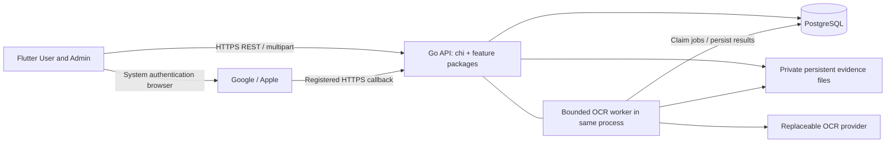

# Rendez backend architecture

Architecture and technology research — 21 September 2026. Status: recommended MVP architecture; no implementation is included.

## 1. Executive summary

Build one Go modular monolith, organized by business capability, serving the existing Flutter application over REST/JSON. Use **chi, PostgreSQL, sqlc + pgx, and Goose**. Use explicit validation, `log/slog`, environment configuration, a private persistent file volume, and a bounded in-process OCR worker whose jobs and results live in PostgreSQL. Use Google and Apple federated authentication to establish **Rendez-owned opaque sessions**.

The central design is an immutable evidence and price history with explicit publication decisions. A submission, OCR result, reviewed structured version, published price observation, and current presentation pointer are different things. An outage cannot reject evidence; an approval cannot erase history; an upload cannot grant public access.

This is sized for two developers and one city's curated dataset. No broker, Redis, search server, PostGIS, separate Admin application, social subsystem, or generic repository framework is justified. Exact transparency scoring and freshness thresholds remain deliberately undefined.

Throughout this document:

- **SRS REQUIRED** identifies formal requirements, including their clarified interpretation.
- **APPROVED PRODUCT DECISION** identifies the binding decisions in reconciliation §§13–14.
- **ENGINEERING DECISION** identifies the proposed, normally reversible implementation choices. All technology selections, package layouts, API shapes, schema mechanisms, numerical operational limits, and test approaches below have this classification unless explicitly marked otherwise.

## 2. Architecture drivers and constraints

**SRS REQUIRED:** backend authority over business data, roles and publication; durable relational integrity; replaceable OCR; Docker deployment; Vietnamese presentation; Android 10+/iOS 15+ support. The SRS does not mandate Go frameworks, JWT, an ORM, an API gateway product, or a routing service.

**APPROVED PRODUCT DECISION:** compact discovery, one city, limited categories, generic goods/services, Google/Apple only, private receipt originals, soft expiry, optional contributor corrections, immutable submissions, shared mobile Admin surface, PostgreSQL with selective JSONB.

**ENGINEERING DECISION:** prioritize correctness, maintainability, explicit semantics, official documentation, agent-readable code, low handwritten repetition, transparent debugging, meaningful tests, simple operations, and sufficient performance—in that order. SQL and transaction boundaries should remain visible. Add an interface for an actual external boundary, not for every database query.

SRS §5.1 measures performance against a **fixed, documented acceptance dataset and environment**: main UI ≤3 seconds; ordinary reads and search/filter ≤2 seconds; UI processing feedback after 500 ms; finite dependency timeouts; upload progress or completion/failure. These are acceptance targets, not measured results or commercial-scale service guarantees. Record dataset counts, image sizes, devices, network and deployment configuration before measuring.

## 3. Requirements precedence and SRS reconciliation notes

Source review covered the complete [44-page SRS](SRS_PBL6.pdf), including the software-interface and use-case diagrams, the complete [product reconciliation](product-reconciliation.md), and actual Flutter source described in §36. Printed SRS page numbers are two less than PDF page numbers. This was source inspection, not a running-app assessment. Existing backend code is not evidence of conformance to this proposed architecture and was not made the selection baseline.

Precedence: reconciliation §§13–14 supersede §12 questions, earlier recommendations, and prototype assumptions. The SRS remains the formal source; implement its mandatory capabilities under the approved interpretation. The following are proposed wording clarifications only; the SRS has not been edited.

| Exact SRS reference / conflict | Why it exists | Smallest clarification and design consequence |
|---|---|---|
| FR-01, UC-01, SEC-02; account decomposition diagram on printed p17 includes password recovery | Legacy account wording assumes credentials that §13.9 excludes | Registration provisions a Rendez account after successful federation. Password hashing/recovery is inapplicable without local passwords. Preserve authentication and session security; provider recovery remains provider-owned. |
| §2.1 mentions a web application; §3.2.2 and software-interface diagram require mobile Admin | Inconsistent platform descriptions | Name one Flutter User/Admin application. No separate web Admin deliverable. |
| §3.1.1 lists separate screens; §2.2 defers quick filters | Screen structure was mixed with capability scope | Permit integrated tabs/sheets and shortcuts for supported FR-07 filters. |
| FR-09, UC-07 leave cost basis undefined | Prototype conflates item prices with spend per person | Dated approved receipt total divided by positive known guest count satisfies MVP spending examples; unavailable otherwise. No universal prediction. |
| BR-06 and place diagrams use “verified” without criteria | Publication and evidence review were conflated | Replace the generic claim with publication state, evidence decision, observation/review dates and provenance. No `is_verified` field. |
| BR-08 requires transparency-prioritized ranking, whereas §§13.3/14 defer score policy | Formal acceptance wording is stronger than the approved research scope | Preserve relevance first and the factual inputs for a future transparency signal; explicitly defer the ranking policy. Initial ordering is deterministic relevance/distance/name, not a secretly invented score. BR-08 ranking acceptance remains a documented policy gap, not falsely claimed complete. |
| FR-19/20 and UC-09 automatic rejection versus UC-10 timeout/manual-entry alternatives | Invalid content and failed extraction were not separated | Automatic checks record validity and extraction availability. Invalid content may be rejected; outage is retryable; valid incomplete extraction can reach manual review. Two review layers remain. |
| FR-08, §3.3 diagrams show Map Service | Diagrams suggest a dependency that §2.5.5 makes optional | Backend calculates approximate straight-line distance from supplied coordinates; no routing provider required. |
| Place-information decomposition, printed p17, includes original receipt images | Privacy was not specified | Public structured receipt data may have an explicitly approved redacted image. Original receipts remain private. Menu images still support FR-05. |
| Contribution decomposition, printed p20, includes editing submitted contributions | No version/review concurrency semantics | Corrections create replacement submissions; submitted material cannot change in place. |
| BR-12 broadly applies the approved-contribution condition to drafts | Community proposals and Admin seed entry were not distinguished | Community-origin drafts require an approved contribution; Admin seed places follow direct validation and confirmation, with prices separately reviewed. |
| §2.5.2 prohibits direct external-service access | Too broad for federated login and device location | Permit provider authentication UI and OS location acquisition. Business writes and OCR remain backend-mediated. Default image serving remains through backend. |
| FR-12 / UC-05 deletion versus provenance preservation | Physical deletion semantics were unspecified | Admin deletion removes a place from product availability through a retained tombstone; physical deletion is permitted only for unreferenced mistakes. Preserve linked historical evidence. |
| UC-04 alternative 1a treats empty keyword as invalid | Integrated browse/filter can have no keyword | Empty keyword means ordinary browsing; malformed filters remain errors. |
| §6.1 omits contribution/evidence/moderation groups | Minimum list predates detailed community flow | Add these storage groups and ownership relationships without changing the core relational requirement. |

Logout, image validation, reasons and contribution tracking are included even where FR-03/20/23 and SEC-08/09 are Should-level, as approved in §13.12. No other Should requirement is automatically promoted.

Traceability: FR-01–03 → §§19–21; FR-04–09 → §§15,22–23,28–29; FR-10–11 → §§18,20,22; FR-12–16 → §§17–18,22,24–27; FR-17–23 → §§12–18,22,25–27. SEC-01–11 → §§19–21,30–31,34,37. BR-01–14 → §§15–18,20,23,29,37. NFR-01–25 → §§2,22,27–37. User/Admin manuals in SRS §2.6 remain delivery obligations, outside this architecture artifact.

## 4. Approved product decisions affecting backend design

All rows are **APPROVED PRODUCT DECISION**; their implementation mechanisms are engineering choices.

| Binding decision | Backend consequence |
|---|---|
| Discovery and price transparency are the MVP | Public read API supports coherent detail tabs; no screen-per-endpoint requirement. |
| Menu/service price ≠ receipt total ≠ receipt spend/person ≠ visit estimate | Typed basis and unit accompany every numeric summary. Missing data is null plus an explanation. |
| No generic verification | Distinct place visibility, immutable moderation decision, source facts, access rules and derived presentation. |
| Evidence ages progressively | Preserve observation dates; review never rejuvenates them. No authoritative freshness/score column. |
| Receipt originals private | Separate original and public-safe asset records; explicit public-image approval. |
| Submissions immutable | Separate Admin review versions; contributor correction means a new submission with a replacement link. |
| OCR is assistance | Durable execution status, incomplete-result warnings, manual review and final Admin publication. |
| Google and Apple identities | Internal user UUID plus unique provider issuer/subject; no email-based merge. |
| Same Flutter app for Admin | Server checks role and ownership on every relevant operation. |
| One city, categories not frozen | Catalog tables and generic pricing units; no restaurant-specific entities. |
| Sharing without social features | Stable place UUID and app-link-friendly URL; platform share sheet. |

## 5. Recommended backend technology stack

**ENGINEERING DECISION.** Research checked official sources on 2026-09-21. Links below and in §6 are the dependency/source register. Pin exact compatible releases and container digests during bootstrap; mutable documentation and repository default branches are not a lockfile. Do not select preview releases merely because they appear in a current documentation site.

| Concern | Selected default | Official source |
|---|---|---|
| Runtime | Supported stable Go; current research baseline Go 1.27 family | [Go release history](https://go.dev/doc/devel/release) |
| HTTP | `net/http` with chi v5 | [chi](https://github.com/go-chi/chi) |
| Database | PostgreSQL 18 family; UTF-8 | [PostgreSQL documentation](https://www.postgresql.org/docs/current/) |
| Queries | sqlc-generated feature-local query methods using pgx v5 / pgxpool | [sqlc](https://docs.sqlc.dev/en/latest/), [pgx](https://github.com/jackc/pgx) |
| Migrations | Goose v3, reviewed SQL migrations | [Goose](https://pressly.github.io/goose/) |
| Request/domain validation | Explicit checks and standard JSON decoding | [encoding/json](https://pkg.go.dev/encoding/json) |
| Federation | `golang.org/x/oauth2` for code exchange; `lestrrat-go/jwx/v3` for JWS/JWT/JWKS and Apple client-secret signing | [oauth2](https://pkg.go.dev/golang.org/x/oauth2), [jwx](https://github.com/lestrrat-go/jwx) |
| Rendez sessions | Random opaque bearer token; SHA-256 digest in PostgreSQL | [crypto/rand](https://pkg.go.dev/crypto/rand), [crypto/sha256](https://pkg.go.dev/crypto/sha256) |
| Contract | Spec-first OpenAPI 3.0.x; handwritten small HTTP boundary; no server/client generation initially | [OpenAPI specification](https://spec.openapis.org/oas/v3.0.3.html) |
| Contract tests | kin-openapi, test-only direct dependency | [kin-openapi](https://github.com/getkin/kin-openapi) |
| Logging/config | `log/slog`, `os.LookupEnv`, `strconv`, `time` | [slog](https://pkg.go.dev/log/slog), [os](https://pkg.go.dev/os) |
| Search | PostgreSQL predicates and `unaccent`; trigram indexes only after measurement | [unaccent](https://www.postgresql.org/docs/current/unaccent.html), [pg_trgm](https://www.postgresql.org/docs/current/pgtrgm.html) |
| Images | Backend multipart → private persistent file volume; DB asset metadata | [net/http](https://pkg.go.dev/net/http), [image](https://pkg.go.dev/image), [Docker volumes](https://docs.docker.com/engine/storage/volumes/) |
| OCR execution | PostgreSQL durable job + bounded worker in API process | [PostgreSQL locking clauses](https://www.postgresql.org/docs/current/sql-select.html) |
| OCR engine | Cloud Vision is the first evaluation candidate, not a purchased/approved dependency | [Vision OCR](https://docs.cloud.google.com/vision/docs/ocr) |
| Tests/deployment | `testing`, `httptest`, real PostgreSQL via Docker Compose | [testing](https://pkg.go.dev/testing), [httptest](https://pkg.go.dev/net/http/httptest), [Compose](https://docs.docker.com/compose/) |

The exact OCR provider and spending ceiling require an evidence-based choice under SRS TBD-02 (§40). The backend boundary and reliable execution model do not depend on that choice.

## 6. Technology decision matrix

All decisions here are **ENGINEERING DECISION**. “Boilerplate” means handwritten application work, not total generated lines. “Agent friendliness” means whether an agent can trace source → behavior → failure with reliable primary documentation. No popularity or unsupported numeric scores are used.

### 6.1 HTTP/router

| Candidate | Official documentation/source | Advantages | Disadvantages | Boilerplate level | Debugging transparency | Testing ergonomics | AI-agent/documentation friendliness | Lock-in / migration concerns | Fit for Rendez | Decision |
|---|---|---|---|---|---|---|---|---|---|---|
| net/http ServeMux | [Go routing](https://go.dev/blog/routing-enhancements) | Method/path matching; standard middleware/handlers | Group middleware and common errors need small helpers; validation/OpenAPI separate | Moderate | Direct call stack | Excellent httptest | Excellent standard docs | Minimal | Fully sufficient; slightly more route grouping work | Runner-up |
| chi | [Official repository](https://github.com/go-chi/chi) | Standard handlers; composable route groups and middleware | JSON/errors/validation/OpenAPI still explicit | Low–moderate | Direct net/http flow | Excellent httptest | Small API, concrete examples | Low; replace router without rewriting business functions | Auth/Admin grouping saves real code | **Select** |
| Gin | [Docs](https://gin-gonic.com/en/docs/), [binding](https://gin-gonic.com/en/docs/examples/binding-and-validation/) | Concise JSON binding; validator integration; middleware | Custom context; binding/error paths require deliberate normalization; OpenAPI external | Low CRUD handlers | Understand binding/abort behavior | HTTP tests easy | Extensive docs; framework conventions | Handler rewrite on exit | Saves transport code, little domain code | Reject default |
| Echo | [Quickstart](https://echo.labstack.com/guide/quickstart/) | Error-returning handlers, centralized HTTP errors, binding | Custom context; validator integration must be configured; OpenAPI external | Low | Clear errors, framework binding rules | Good HTTP tests | Good focused guide | Handler/context coupling | Good alternative, no decisive advantage over chi | Reject default |
| Fiber | [Docs](https://docs.gofiber.io/) | Concise APIs, integrated middleware and binding facilities | Fasthttp semantics and borrowed-value lifetime concerns; adapters for net/http; OpenAPI external | Low initially | Additional framework/lifetime rules | Framework test helper | Good docs, version-specific APIs matter | Higher transport coupling | Throughput advantage does not address MVP bottlenecks | Reject |

All five need application-level error codes, ownership checks and publication transactions. chi is not a validation or OpenAPI framework; a small explicit JSON/error helper is intentional.

### 6.2 PostgreSQL/data access

| Candidate | Official documentation/source | Advantages | Disadvantages | Boilerplate level | Debugging transparency | Testing ergonomics | AI-agent/documentation friendliness | Lock-in / migration concerns | Fit for Rendez | Decision |
|---|---|---|---|---|---|---|---|---|---|---|
| database/sql | [Go docs](https://pkg.go.dev/database/sql) | Standard pool/transaction API; SQL fully visible | Driver required; manual scans and null handling; no SQL type checking | High for many result shapes | High | Real DB straightforward | Excellent docs; repetitive mapping prone to mistakes | Low API coupling | Sound but does not minimize handwritten query plumbing | Reject standalone |
| pgx | [Official repository](https://github.com/jackc/pgx) | PostgreSQL-native types, JSONB, pool, transactions and custom SQL | Query text/scans handwritten without generator | Moderate–high alone | High | Excellent real PostgreSQL tests | Good Go docs | PostgreSQL-specific intentionally | Best driver for selected database | **Select with sqlc** |
| sqlc + pgx | [Configuration](https://docs.sqlc.dev/en/latest/reference/config.html), [transactions](https://docs.sqlc.dev/en/latest/howto/transactions.html) | SQL input → typed params/results; generated scans; explicit joins/locks | Generate step; query variants for filtering; type overrides sometimes needed | Moderate SQL, low Go plumbing | High; generated code contains SQL | Test behavior on DB, not mocks | Excellent trace from query name to SQL | SQL survives generator replacement | Strong fit for moderation/history queries | **Select** |
| GORM | [Guides](https://gorm.io/docs/), [updates](https://gorm.io/docs/update.html) | Very short CRUD; associations; transactions; JSON serializers/custom SQL available | ORM conventions, zero-value updates, association writes need care; complex queries still SQL | Low CRUD, moderate complex flow | Inspect generated SQL and model tags | Integration tests essential | Extensive docs; implicit behavior needs attention | ORM model/query coupling | Attractive initial code size, less benefit in critical publication path | Reject default |
| Ent | [Docs](https://entgo.io/docs/getting-started/) | Generated typed schema/query builder, relationships, transactions | Large generated surface, schema DSL; custom SQL and migration workflow add concepts | Low usage; moderate schema/generation setup | Trace builder to SQL | Good DB tests | Strong docs; more artifacts to inspect | DSL/codegen coupling | More machinery than this team needs | Reject |
| Bun | [Guide](https://bun.uptrace.dev/guide/) | SQL-oriented ORM, joins, transactions, PostgreSQL types | Reflection/tags; query correctness still largely runtime | Low–moderate | Better SQL proximity than many ORMs | Good DB tests | Good SQL-centric docs | Builder/model tags | Reasonable compromise, no advantage over typed explicit queries here | Reject default |

**GORM versus sqlc + pgx:** a GORM favorite insert is shorter than writing a named SQL query. But Rendez's difficult writes are conditional multi-table publication, current-price replacement, identity uniqueness and job leases. Those still require explicit transactions and constraints in GORM. Its default per-write transaction does not make an entire approval atomic. Struct updates can omit zero-valued fields unless selected explicitly; clearing a value needs care. Its current generics API improves Go-side typing but does not replace compile-time checking of arbitrary SQL against a schema. These are manageable behaviors, not claims that GORM is unsafe. [GORM transactions](https://gorm.io/docs/transactions.html), [updates](https://gorm.io/docs/update.html).

sqlc removes repeated scanning and parameter plumbing while keeping these operations reviewable as SQL. It does **not** generate business rules, migrations, all possible CRUD operations or safe dynamic SQL. Use a handful of static query variants with allowlisted sort choices. Keep feature query sources beside their use cases; generate into feature-private packages with unused table models omitted. Some generated type duplication between features is acceptable; do not handwrite mapper layers merely to hide generated types internally. Explicit API structs are justified where they prevent private columns leaking.

Goose SQL migrations are schema truth; sqlc can read migration directories. Regenerate after schema/query changes and test both migrations and queries against PostgreSQL. Neither sqlc nor any ORM eliminates runtime constraint/concurrency failures. [sqlc schema changes](https://docs.sqlc.dev/en/latest/howto/ddl.html), [data types/JSONB](https://docs.sqlc.dev/en/latest/reference/datatypes.html).

### 6.3 Migrations

| Candidate | Official documentation/source | Advantages | Disadvantages | Boilerplate level | Debugging transparency | Testing ergonomics | AI-agent/documentation friendliness | Lock-in / migration concerns | Fit for Rendez | Decision |
|---|---|---|---|---|---|---|---|---|---|---|
| golang-migrate | [Repository](https://github.com/golang-migrate/migrate) | Explicit up/down SQL, CLI, broad support | Paired files and dirty-state recovery procedures | Low | High | Good disposable-DB tests | Mature docs | Low; SQL portable | Equally viable small tool | Runner-up |
| Goose | [Docs](https://pressly.github.io/goose/), [annotations](https://pressly.github.io/goose/documentation/annotations/) | Up/down in one reviewed SQL file; transactional default | Annotation rules; nontransactional operations need explicit treatment | Low | High | Good real-DB migration tests | Short clear workflow | Low | Fewer moving parts for two authors | **Select** |
| Atlas | [Versioned migrations](https://atlasgo.io/versioned/intro) | Schema diff and planning, versioned workflow | Additional declarative/diff concepts and tool surface; generated changes still need review | Low generated SQL, more tooling | Good if SQL plans reviewed | Strong tooling, extra setup | Good docs, broader workflow | Some workflow coupling | Benefits not needed for this schema size | Reject |

Never run ORM AutoMigrate on application startup. Applied migrations are immutable. Down migrations are explicit developer tools, not a guarantee of lost-data recovery; deploy forward fixes and use tested backups for destructive failures. Run one migration job before API startup.

### 6.4 Validation

| Candidate | Official documentation/source | Advantages | Disadvantages | Boilerplate level | Debugging transparency | Testing ergonomics | AI-agent/documentation friendliness | Lock-in / migration concerns | Fit for Rendez | Decision |
|---|---|---|---|---|---|---|---|---|---|---|
| Explicit/manual | [JSON decoder](https://pkg.go.dev/encoding/json) | Clear null/range/cross-field checks and error codes | Repeats simple checks | Moderate, bounded | Excellent | Table tests | Familiar Go logic | Minimal | Few request families; domain checks needed anyway | **Select** |
| go-playground/validator | [Repository](https://github.com/go-playground/validator) | Concise tags, reusable structural rules | Tags and translation/error mapping; business state still external | Low structural checks | Good with tag knowledge | Good | Strong docs | Low–moderate | Add only if repetitive structural validation becomes material | Defer |
| Framework-native binding/validation | [Gin binding](https://gin-gonic.com/en/docs/examples/binding-and-validation/) | Convenient transport integration | Framework-specific defaults and errors; chi has no native validator | Low | Framework-dependent | Good | Documented but extra conventions | Framework coupling | Would not justify changing router | Reject |

### 6.5 Federation libraries and session strategies

| Candidate | Official documentation/source | Advantages | Disadvantages | Boilerplate level | Debugging transparency | Testing ergonomics | AI-agent/documentation friendliness | Lock-in / migration concerns | Fit for Rendez | Decision |
|---|---|---|---|---|---|---|---|---|---|---|
| Google idtoken package | [Go API docs](https://pkg.go.dev/google.golang.org/api/idtoken) | Google-maintained Google token verification | Does not cover Apple; still need nonce/flow controls | Low Google-only | Good | Fake token/key endpoints | Strong provider docs | Google-specific | Good native Google option, not one cross-provider boundary | Reject default |
| go-oidc | [Repository](https://github.com/coreos/go-oidc), [API](https://pkg.go.dev/github.com/coreos/go-oidc/v3/oidc) | OIDC discovery, verification, key management | Nonce and application flow remain caller responsibilities; Apple client-secret signing separate | Low verification | Good | Local issuer/JWKS tests | Focused docs | Low OIDC coupling | Strong alternative; adds separate signing library for Apple | Runner-up |
| jwx + x/oauth2 | [jwx](https://github.com/lestrrat-go/jwx), [oauth2](https://pkg.go.dev/golang.org/x/oauth2) | JWS/JWT/JWKS plus signing; code-exchange helper | Explicit provider claim policy required; not a complete login system | Moderate | Explicit checks | Local keys/provider fake | Good APIs; pin major version | Confined to auth adapter | One JOSE library handles verification and Apple signing | **Select** |
| golang-jwt | [Repository](https://github.com/golang-jwt/jwt) | Focused JWT signing/parsing/claims | Need JWKS retrieval/cache integration | Moderate | Good | Easy local signatures | Good docs | Low | More key-management glue than jwx | Reject default |
| Opaque DB session | [Go randomness](https://pkg.go.dev/crypto/rand), [PostgreSQL](https://www.postgresql.org/docs/current/) | Immediate revocation; current roles; one credential | One indexed DB lookup per protected request | Low | Excellent | Easy expiry/revocation tests | Small explicit mechanism | Minimal | DB already needed for protected actions | **Select** |
| JWT access + refresh | [JWT library](https://github.com/golang-jwt/jwt) | Offline access verification; short access credential | Rotation/reuse/revocation and stale role claims add state and keys | Moderate–high | More paths to inspect | More concurrency tests | Good docs but more policy | Token format/signing commitment | No offline verification requirement | Reject |

### 6.6 API contract/generation

| Candidate | Official documentation/source | Advantages | Disadvantages | Boilerplate level | Debugging transparency | Testing ergonomics | AI-agent/documentation friendliness | Lock-in / migration concerns | Fit for Rendez | Decision |
|---|---|---|---|---|---|---|---|---|---|---|
| Spec-first OpenAPI + small handwritten handlers | [OAS](https://spec.openapis.org/oas/v3.0.3.html), [kin-openapi](https://github.com/getkin/kin-openapi) | Shared Go/Flutter contract; deliberate privacy/error shapes | Must test implementation for drift | Moderate | High | Request/response contract tests | Language-independent contract | Low | Review API before UI integration | **Select** |
| Spec-first + oapi-codegen Go types/server | [Repository](https://github.com/oapi-codegen/oapi-codegen) | Removes binding/type repetition, supports chi | Extra generated interfaces/adapters and schema workflow | Low handwritten, more generated artifacts | Good, more files | Good | Good docs; default branch may describe unreleased features | Low–moderate | Useful if transport repetition grows | Defer, do not generate now |
| Code-first Huma | [Docs](https://huma.rocks/) | Generates OpenAPI from typed handlers with validation | Additional transport/schema framework conventions | Low | Good, framework-driven | Good | Coherent docs | Moderate | Valuable package, but not necessary alongside simple chi boundary | Reject default |
| Annotation-based Swag | [Repository](https://github.com/swaggo/swag) | Familiar code-local documentation | Comments can drift; primary output is Swagger 2.0 | Low–moderate | Good | Separate contract tests | Good but multiple truth surfaces | Annotation/tool coupling | Less suitable than one explicit OpenAPI contract | Reject |
| Prose-only hand-maintained docs | [OAS comparison](https://spec.openapis.org/oas/v3.0.3.html) | No tooling | No machine validation; Go/Flutter drift easy | Low now, high correction cost | Superficially clear | Weak | Ambiguity harms agents | Low | Insufficient contract discipline | Reject |
| Generated Flutter client/types | [Dart Dio generator](https://openapi-generator.tech/docs/generators/dart-dio/) | Shared schema and less serialization work | Generated model/client/build dependencies; nullability and upload integration need checks | Low handwritten, larger generated surface | Moderate | Good after integration setup | Good tooling docs | Generator/runtime coupling | Start with small feature DTOs/API calls and contract fixtures | Defer |

Use OpenAPI 3.0.x deliberately as an adequate compatibility target, not as a claim that it is the newest specification. Document nullable fields, decimal strings, enum forward compatibility, multipart, bearer auth and all error codes. sqlc is the only application-code generation pipeline selected initially; kin-openapi validates contracts in tests.

### 6.7 Logging, configuration and testing

| Candidate | Official documentation/source | Advantages | Disadvantages | Boilerplate level | Debugging transparency | Testing ergonomics | AI-agent/documentation friendliness | Lock-in / migration concerns | Fit for Rendez | Decision |
|---|---|---|---|---|---|---|---|---|---|---|
| log/slog | [Go docs](https://pkg.go.dev/log/slog) | Structured JSON, levels, standard library | App must choose safe attributes | Low | High | Capture handler output | Excellent | Minimal | Sufficient volume and correlation | **Select** |
| zerolog | [Repository](https://github.com/rs/zerolog) | Efficient structured fluent API | Extra logging API/dependency | Low | Good | Good | Good | Call-site coupling | No measured logging bottleneck | Reject |
| zap | [Repository](https://github.com/uber-go/zap) | Efficient typed fields and ecosystem | Extra configuration/API surface | Low–moderate | Good | Good | Good | Call-site coupling | Unneeded performance specialization | Reject |
| Env + standard library | [os](https://pkg.go.dev/os) | Explicit typed configuration and startup errors | A little parsing code | Low for this config | Excellent | Setenv/table tests | Excellent | Minimal | One typed Config struct | **Select** |
| caarlos0/env | [Repository](https://github.com/caarlos0/env) | Small env-to-struct helper | Tags/default rules to learn | Very low | Good | Good | Good | Low | Reasonable later reduction of parsing repetition | Defer |
| Viper | [Repository](https://github.com/spf13/viper) | Many formats, sources, dynamic configuration | Precedence surface not needed here | Low setup, more behavior | Moderate | Good with isolation | Extensive docs | Moderate | No config discovery/hot-reload need | Reject |
| testing + httptest + Compose PostgreSQL | [testing](https://pkg.go.dev/testing), [httptest](https://pkg.go.dev/net/http/httptest), [Compose](https://docs.docker.com/compose/) | Familiar tests against actual DB semantics | Test DB lifecycle outside Go tests | Low–moderate | Excellent | Good locally/CI | Excellent | Low | Reuses required local stack | **Select** |
| testcontainers-go | [Postgres module](https://golang.testcontainers.org/modules/postgres/) | Automated isolated DB lifecycle | Docker socket/runtime dependency and extra startup | Moderate setup | Good | Excellent when Docker available | Good examples | Low | Useful if shared test DB becomes cumbersome | Defer |
| Extensive SQL mocks | [database/sql](https://pkg.go.dev/database/sql) | Fast isolated interaction tests | Do not validate locks, constraints, SQL semantics | High maintenance | Misleading confidence | Fast but brittle | Duplicated expected SQL | Test coupling | Wrong seam for critical invariants | Reject |

### 6.8 Search, storage, OCR execution and geospatial choices

| Candidate | Official documentation/source | Advantages | Disadvantages | Boilerplate level | Debugging transparency | Testing ergonomics | AI-agent/documentation friendliness | Lock-in / migration concerns | Fit for Rendez | Decision |
|---|---|---|---|---|---|---|---|---|---|---|
| PostgreSQL equality + normalized substring | [Pattern matching](https://www.postgresql.org/docs/current/functions-matching.html), [unaccent](https://www.postgresql.org/docs/current/unaccent.html) | Simple filters and Vietnamese accent-insensitive lookup | Leading wildcard may scan; no typo correction | Low | EXPLAIN + visible SQL | Real dataset tests | Strong docs | Low | One-city dataset; measure first | **Select** |
| PostgreSQL pg_trgm | [Docs](https://www.postgresql.org/docs/current/pgtrgm.html) | Indexed substring and similarity | Extra index/storage; short tokens less selective | Low–moderate | High | Real query plans | Strong docs | Small PostgreSQL extension | First upgrade if scans fail targets | Defer until measured |
| PostgreSQL full-text search | [Docs](https://www.postgresql.org/docs/current/textsearch.html) | Token search and ranking | Language/tokenization work; no assumption of Vietnamese linguistic support | Moderate | High but dictionary-aware | Corpus tests | Strong docs | PostgreSQL text-search config | Venue names/addresses favor substring first | Reject default |
| External search service | [PostgreSQL alternatives](https://www.postgresql.org/docs/current/textsearch.html) | Specialized capabilities if later needed | Extra service, index synchronization and operations | High | Cross-system failures | More integration setup | Multiple systems | High operational coupling | No demonstrated need | Reject |
| Private file volume + backend delivery | [os](https://pkg.go.dev/os), [volumes](https://docs.docker.com/engine/storage/volumes/) | Smallest single-host storage; authorization stays in Go | Requires persistent host and coordinated backups | Low | High | Temp directories/fault injection | Familiar primitives | Move keys through storage adapter later | Fits Docker MVP | **Select local and deployed default** |
| Private object storage | [S3 access](https://docs.aws.amazon.com/AmazonS3/latest/userguide/using-presigned-url.html) | Durable managed storage; host-independent | Billing/IAM/SDK and lifecycle configuration | Moderate | Provider + DB states | Adapter fake plus provider smoke test | Strong docs | Isolate provider SDK | Needed if host disk is ephemeral | Conditional replacement, not additional default service |
| Images in PostgreSQL | [Binary data](https://www.postgresql.org/docs/current/datatype-binary.html) | One transactional store | Enlarges backups/DB I/O for image delivery | Low initially | High | Easy DB tests | Good docs | Blob extraction later | No reason to burden primary DB | Reject |
| Multipart through Go | [net/http](https://pkg.go.dev/net/http) | One authorization/validation path; immediate content checks | Backend handles bytes | Low | High | httptest malformed uploads | Excellent | Low | Bounded images, low traffic | **Select** |
| Direct presigned upload | [S3 presigned URLs](https://docs.aws.amazon.com/AmazonS3/latest/userguide/using-presigned-url.html) | Offloads transfer | Finalize/ownership/orphan workflow still required; URL is reusable until expiry | Moderate–high | Multi-step | More failure cases | Strong docs | Storage-specific protocol | Unjustified at MVP volume | Defer |
| Synchronous OCR in request | [Vision OCR](https://docs.cloud.google.com/vision/docs/ocr) | Short happy path | Timeout/retry/accepted-work ambiguity; ties up requests | Low happy path, high recovery | Simple until outage | Timeout tests harder | Clear provider docs | Low provider coupling with adapter | Fails reliable acceptance behavior alone | Reject |
| In-process worker + PostgreSQL jobs | [SKIP LOCKED](https://www.postgresql.org/docs/current/sql-select.html) | Durable status and recovery without broker | Lease/retry/fencing logic required | Moderate, bounded | Inspect jobs and runs in SQL | Crash/concurrency tests | Standard SQL/Go | Low | Meets actual reliability need | **Select** |
| External queue/broker | [PostgreSQL queue-capable locks](https://www.postgresql.org/docs/current/sql-select.html) | Independent worker scaling | Extra service and DB/enqueue consistency problem | High | More systems | More setup | More concepts | Operational coupling | No independent scale requirement | Reject |
| Go Haversine | [math](https://pkg.go.dev/math) | Tiny computation for a detail response | Whole candidate set must be fetched for globally correct radius/sort | Low detail, higher list logic | High | Easy unit tests | Excellent | Low | Cannot calculate only after paging | Reject list default |
| PostgreSQL Haversine | [Math functions](https://www.postgresql.org/docs/current/functions-math.html) | Radius/sort before pagination in one query | No spatial index for arbitrary origin | Low–moderate SQL | High | Known coordinate pairs | Excellent | Low | One-city volume with measured limits | **Select** |
| PostGIS geography | [ST_DWithin](https://postgis.net/docs/ST_DWithin.html) | Spatial indexing, metric distance and richer queries | Extension and spatial semantics/operations | Moderate | Good | Real extension DB required | Strong docs | Additional schema/extension | Reconsider only when measured radius queries require it | Defer |

### 6.9 OCR provider evaluation

| Candidate | Official documentation/source | Advantages | Disadvantages | Boilerplate level | Debugging transparency | Testing ergonomics | AI-agent/documentation friendliness | Lock-in / migration concerns | Fit for Rendez | Decision |
|---|---|---|---|---|---|---|---|---|---|---|
| Cloud Vision document OCR | [Docs](https://docs.cloud.google.com/vision/docs/ocr) | Managed OCR, text/layout responses, Go samples | External cost/privacy/availability; not a ready-made menu-to-price parser | Low runtime integration; parsing still needed | Provider diagnostics + retained runs | Fake plus small consented corpus | Strong official docs | Isolate adapter and raw response | Lowest first operational burden | **First evaluation candidate; cost/provider approval pending** |
| Tesseract | [Manual](https://tesseract-ocr.github.io/tessdoc/) | Local execution, no per-request vendor service | Native binary/models, preprocessing and layout extraction effort | Moderate | Local reproducibility | Easy offline corpus | Good docs | Low | Credible low-cost fallback; accuracy unmeasured | Benchmark alternative |
| PaddleOCR | [Repository](https://github.com/PaddlePaddle/PaddleOCR) | Rich OCR/document tooling | Python/model/runtime footprint beyond Go deployment | Higher operations | More runtime layers | Corpus tests | Extensive but broader docs | Model/runtime coupling | Only if measured accuracy warrants extra runtime | Not default |

Do not cite generic OCR language support as evidence of accurate Vietnamese menu prices. Compare name/amount/unit pairing, accents, rotated/blurred receipts, line alignment, latency, manual correction burden, deployment memory and actual cost on the same sample corpus. No benchmark has been performed in this phase.

## 7. Rejected alternatives and rationale

**ENGINEERING DECISION:** no microservices, Kubernetes, Kafka/RabbitMQ, Redis, event bus, CQRS, event sourcing, distributed cache, generic DI container, enterprise repository hierarchy or document database. They do not resolve a requirement that PostgreSQL transactions and one process cannot handle.

Immutable price observations are ordinary historical records, not event sourcing. Job rows are a small durable work list, not a generic queue product. A storage/OCR interface is justified by external substitution; a `Repository[T]` wrapping every query is not. No PostGIS solely because coordinates exist. No AI recommendation algorithm, generic workflow engine, image-redaction AI service or provider orchestration platform.

## 8. High-level system architecture

**SRS REQUIRED:** backend-mediated business data, authoritative authorization and Admin-confirmed prices. **ENGINEERING DECISION:** one deployable Go process and one PostgreSQL database.



The worker may execute in a goroutine, but work ownership is a durable lease in PostgreSQL. Stopping the goroutine never loses the accepted submission. No remote calls occur inside a publication database transaction. A host TLS terminator exposes only HTTPS; PostgreSQL and evidence files are not public services.

## 9. Feature/package boundaries

**ENGINEERING DECISION:** boundaries follow invariants rather than screen names.

| Package | Responsibility and ownership |
|---|---|
| `auth` | Federation attempts, issuer/subject identities, users, roles, sessions, linking and current-profile API. No separate users package until profile behavior warrants one. |
| `places` | Place catalog, categories/units, public price/provenance reads, search, distance, Admin basic place management. Search/location are initially files here, not artificial services. |
| `favorites` | Owner-scoped save/remove/list, including unavailable saved-place tombstones. |
| `contributions` | Intake, immutable evidence association, structured versions, personal status, Admin review and atomic publication. Moderation belongs here because it completes the same aggregate. |
| `evidence` | File validation/storage adapter and private/public-safe asset delivery. Never assumes approval from upload success. |
| `ocr` | Provider-neutral extraction result, external provider adapter and execution of leased jobs. It cannot publish prices. |
| `reports` | Small durable wrong/stale/closed-place report workflow; no automatic price mutation. |
| `platform` | Small concrete database pool, HTTP JSON/error helpers, configuration and startup plumbing. No global business models or generic services. |

Public price queries necessarily join publication facts written by contributions. This is deliberate shared-database access in a monolith, not an excuse for every package to mutate every table.

## 10. Proposed Go directory tree

**ENGINEERING DECISION:** illustrative future layout only; do not create these files in this phase. Add a file when the slice needs it. Generated `internal/db` packages below are feature-private SQL adapters, not global repositories.

```text
backend/
  cmd/rendez/main.go                  # composition, shutdown, API + worker
  api/openapi.yaml                    # future contract
  migrations/                        # future ordered Goose SQL
  sqlc.yaml                          # feature query sets, common migration schema
  internal/
    auth/
      handler.go
      federation.go                  # provider verifier boundary
      session.go
      queries.sql
      internal/db/                   # generated sqlc methods/types
    places/
      handler.go
      search.go
      distance.go
      queries.sql
      internal/db/
    favorites/
      handler.go
      queries.sql
      internal/db/
    contributions/
      handler.go
      review.go
      publish.go                     # one explicit approval transaction
      worker.go                      # durable orchestration using ocr adapter
      queries.sql
      internal/db/
    evidence/
      handler.go
      image.go
      storage.go                     # narrow Put/Open/Delete boundary
      filesystem.go
      queries.sql
      internal/db/
    ocr/
      extractor.go                   # provider-neutral result + interface
      provider.go                    # selected adapter, when chosen
    reports/
      handler.go
      queries.sql
      internal/db/
    platform/
      config.go
      postgres.go
      http.go                        # JSON/error/correlation helpers
  Dockerfile
  compose.yaml
```

Feature tests sit next to the behavior they test; integration fixtures use each feature's `testdata/` when needed. No global `controllers`, `services`, `repositories`, `models`, `dto`, or `mappers` directories. A simple favorite handler may call its generated query directly.

## 11. Package dependency rules

**ENGINEERING DECISION:** `main` constructs dependencies explicitly. Platform imports no features. Domain operations accept ordinary values/context, not chi contexts or provider SDK types. Feature-private generated query code is not exported as a public API.

Auth middleware supplies a small authenticated principal; feature authorization uses that principal and durable ownership predicates. `places` never imports `contributions` just to read public data. `contributions` owns cross-table approval SQL and may call narrow place/evidence validation helpers using the **same pgx transaction**; those helpers must not start nested independent transactions. The initial implementation can keep the full transaction in `publish.go` rather than adding interfaces for hypothetical reuse.

`contributions` uses `ocr.Extractor` and `evidence.Storage` for external effects. Neither adapter calls back into contribution publication. This keeps dependencies acyclic. Generated query sets may join other tables for a documented operation; write authority remains assigned in §§13/18. Cross-package IDs are primitive UUID values, not a global domain-model package.

## 12. Domain model

Continuation completed on 22 September 2026. Sections 1–11 remain the research and technology baseline. Concrete mechanisms below are **ENGINEERING DECISION** unless another classification is stated.

**SRS REQUIRED:** durable places, menu/service prices, contributions, OCR drafts and Admin publication. **APPROVED PRODUCT DECISION:** distinct cost meanings, immutable submissions/evidence, private receipt originals and generic goods/services.

| Concept | Meaning and boundary |
|---|---|
| Rendez user | Internal UUID, profile and role. A provider subject authenticates this user but is not its domain identifier. |
| Place | Stable venue identity with Admin-controlled description and publication state. A community proposal is a private draft of this same entity. |
| Price item | Stable identity of one good/service variant at one place. Historical names, prices and units belong to observations, not an overwritten current-value row. |
| Evidence | Immutable source description, observation date and original-image relationships, attached to one submission. A receipt records a purchase; a menu records listed offerings. |
| Contribution | Immutable intake envelope and submitted suggestions, plus separately mutable processing status and review pointer. Submission immutability does not prohibit status progression. |
| Structured version | Immutable snapshot of contributor suggestions, OCR extraction or Admin-corrected structured facts. Admin editing appends a version; it never rewrites submitted facts or an OCR result. |
| Moderation decision | One immutable terminal decision for a contribution, with actor, reason, time and exact reviewed version. |
| Publication | Authorization to expose the reviewed structured version. Later withdrawal changes access, not historical approval. |
| Price observation | A published menu/service line connected to a stable price item and its evidence chain. |
| Current presentation | A nullable pointer from a price item to an approved observation. “Currently selected by Rendez” does not mean guaranteed current venue pricing. |
| Asset | Stored bytes, owner and integrity metadata. Original and public-safe derivative are separate records and file keys. |
| OCR job/run | One durable work item with multiple recorded execution attempts. Successful extraction is not permission to publish. |
| Favorite/report | Owner-scoped personal relationship or request for Admin review. Neither changes official prices. |

The chain is **original evidence → OCR run/result version → Admin review version → approval/publication → selected observation**. Direct Admin entry uses documented `admin_observation` evidence and the same confirmation/publication boundary, with OCR marked not applicable. An Admin uploading a menu uses the normal image/OCR path.

### Money, quantities and units

Use exact integer VND amounts (`bigint`), with explicit currency=`VND`, bounded to 0..10^12 VND. Unknown is null; zero means a reviewed free item. No floating-point storage or invented zero fallback. This engineering ceiling bounds OCR mistakes and keeps JSON integers within safe interoperable ranges. Use `numeric(12,3)` for positive quantities and pricing bases, serialized as decimal strings; no Go float conversion for monetary calculations.

A line states amount, unit code and positive basis quantity: e.g. 150,000 VND per `1` room-hour, or 50,000 VND per `1` admission-person. Unit lookup records express the dimension and Vietnamese label. Different sizes, time bands or other conditions are distinct item variants with short reviewed condition text. Do not build a tariff/rule engine. Never aggregate item, person, room-hour and table-hour prices into one unlabeled range.

Receipt total is separately reviewed from line totals. Taxes, service charges, discounts or incomplete lines may explain a difference. Preserve the actual stated total and a reviewed reconciliation note; do not force it to equal extracted subtotals. A receipt spending example requires an approved known total and a positive known guest count. Calculate total/guests with exact arithmetic, return total and guests as the basis and round the display to nearest VND. Missing guest count does not mean one guest. This is a dated historical example, not a general visit estimate.

## 13. PostgreSQL schema design

**ENGINEERING DECISION:** the following is a concrete conceptual schema, not migrations. It defines the required integrity and access behavior for later implementation.

### 13.1 Common conventions

UUID primary keys are named `id` unless a composite/code key is specified. All fields listed are required unless marked `?` (nullable). Required strings are nonblank with bounded length. Foreign keys use `RESTRICT` for historical domain records; cascade only disposable session/attempt data and personal favorites where explicitly appropriate. Application user deletion normally retains an anonymized user tombstone so historical FKs remain valid.

`created_at` means server insertion time; `updated_at` means last mutable-record change, not source freshness. Both use `timestamptz`. Immutable child lines inherit their version's time and need no redundant timestamp. Observation date/time is separate from receipt capture/upload/review times (§29). Lifecycle columns use checked text, not JSONB or a generic status table. Editable categories and pricing units use lookup tables. No global `is_verified`, score or freshness column.

The tables are introduced with their vertical slice, not all at bootstrap. Indexes are listed per table; do not duplicate an index already provided by a PK/unique constraint. Additional FK indexes are warranted when joins or parent cleanup use them.

### 13.2 Identity and session tables

| Table / purpose / PK | Important columns and FKs | Unique/check constraints | Indexes, timestamps and access |
|---|---|---|---|
| `users`: internal account; PK id | display_name, role=`user/admin`, account_state=`active/deletion_pending/deleted`; email?, avatar_url?, deleted_at? | Role/state check; deleted requires deleted_at; email is **not** unique identity | created_at, updated_at; auth writes; `/me` returns own safe profile. No password fields. |
| `auth_identities`: provider mapping; PK id | user_id→users, provider, issuer, subject; reported_email?, email_verified?, provider_refresh_ciphertext?, encryption_key_id?, provider_checked_at?, revoked_at? | Unique `(issuer,subject)`; checked Google/Apple provider/issuer pairing; ciphertext/key ID paired | user_id index; created_at, last_authenticated_at; auth-only. Encrypted Apple refresh credential is optional by provider and never an API credential. |
| `sessions`: bearer authorization; PK id | user_id→users, identity_id→auth_identities, token_hash bytea, authenticated_at, expires_at, revoked_at? | Unique token_hash; digest length=32; expiry>created_at | `(user_id,created_at)`, expires_at; created_at; auth-only. Raw bearer never persisted. |
| `auth_attempts`: login/link/reauth correlation; PK id | provider, configured_client_key, purpose, state, state_hash, nonce_hash, handoff_challenge, expires_at; bound_user_id?→users, bound_session_id?→sessions, pkce_verifier_ciphertext?, verified_issuer?, verified_subject?, verified_email?, verified_name?, provider_refresh_ciphertext?, completion_hash?, completed_at?, consumed_at? | Unique state_hash and nonnull completion_hash; checked purpose/state; link/reauth require bound user/session; verified fields required in verified state; digest lengths; encryption key identifier alongside ciphertext | expires_at index; created_at; transient auth-only data, expired attempts purged. Typed claims are temporary verified facts, not opaque JSON identity. |

An identity maps to exactly one Rendez user. Multiple identities can map to the same user only by explicit linking. One role column is sufficient: Admin includes User capabilities; there is no Contributor role. `auth_attempts.state` is pending/exchanging/verified/consumed/failed; the exchange claim is single-use and has no automatic replay of a possibly consumed provider code (§19).

### 13.3 Place and pricing catalog

| Table / purpose / PK | Important columns and FKs | Unique/check constraints | Indexes, timestamps and access |
|---|---|---|---|
| `categories`: maintained venue classification; PK code | name_vi, enabled | Nonblank unique stable code | created_at, updated_at; public enabled catalog; referenced categories disabled rather than deleted. |
| `pricing_units`: generic goods/service units; PK code | dimension, label_vi, enabled | Nonblank stable code/dimension | created_at, updated_at; controlled seed/catalog. No restaurant-only enum. |
| `places`: venue or proposal; PK id | name, address, city_code, category_code?→categories, origin=`admin/community`, publication_state=`draft/published/hidden`, revision, creation_hash; latitude?, longitude?, opening_hours?, attributes JSONB?, first_published_at?, deleted_at? | Both coordinates null or both finite/in range; revision>0; published requires category and no deleted_at; city must be configured supported city at intake/publication | `(publication_state,category_code,id)`; created_at, updated_at; places writes basic facts, intake creates drafts, approval coordinator publishes community drafts. |
| `price_items`: stable item/variant and selection; PK id | place_id→places, current_observation_id?→price_observations, retired, revision | Unique `(id,place_id)`; composite current FK enforces observation belongs to same item/place; retired implies current pointer null; revision>0 | place_id index; created_at, updated_at; pointer/retirement writes authorized and audited. No mutable price amount here. |
| `place_assets`: optional venue gallery; PK `(place_id,asset_id)` | place_id→places, asset_id→assets, purpose=`cover/gallery`, position | Unique `(place_id,purpose,position)`; nonnegative position; attach only approved venue_photo asset | asset_id index; created_at; Admin only, public through place eligibility. Receipt assets cannot be repurposed into gallery slots. |

The immutable creation_hash is a SHA-256 digest of canonical creation fields (including the creator UUID), used to distinguish an exact Admin create retry from UUID reuse after later place edits; community drafts populate it from their intake creation facts. A draft may lack category; public places must have one. One primary category is the MVP choice. The final list is data, not hard-coded food types. Missing coordinates remain legal for a published place, producing unavailable distance. City coverage is configured explicitly, not inferred from the prototype's combined “Đà Nẵng & Hội An” label. Attributes cannot substitute for known filter fields.

### 13.4 Intake, evidence and files

| Table / purpose / PK | Important columns and FKs | Unique/check constraints | Indexes, timestamps and access |
|---|---|---|---|
| `assets`: durable upload registry; PK id | owner_id→users, client_upload_id, purpose=`original/public_safe/venue_photo`, storage_key, storage_state=`reserved/ready/attached/deleting/deleted`, upload_lease_until, upload_lease_token; parent_asset_id?→assets, input_sha256?, stored_sha256?, media_type?, byte_size?, width?, height?, public_approved_by?→users, public_approved_at?, public_revoked_at?, deleted_at? | Unique storage_key and `(owner_id,client_upload_id)`; metadata complete before ready; positive bounded size/dimensions; original cannot have public approval; approval actor/time paired; derivative requires original parent | `(storage_state,upload_lease_until)`, parent_asset_id; created_at, ready_at?, attached_at?; evidence package owns, keys never exposed. |
| `contributions`: accepted immutable intake + lifecycle; PK id | submitter_id→users, place_id→places, source=`community/admin`, state, client_request_id, payload_hash, submitted_place_name/address, revision; replaces_id?→contributions, review_version_id?→structured_versions | Unique `(submitter_id,client_request_id)`; unique nonnull replaces_id gives one direct replacement; nonself reference; same owner/place replacement checked under lock; revision>0 | `(submitter_id,created_at,id)`, `(state,created_at,id)`, place_id; created_at=submitted_at; original fields immutable, status/pointer/revision mutable. |
| `evidence`: original source facts; PK id | contribution_id→contributions, kind=`menu/receipt/admin_observation`, source_description, observed_precision=`instant/date/unknown`; observed_at?, captured_at?, submitted_guest_count? | Unique contribution_id and `(id,contribution_id)`; receipt requires observed_at; observed_at null iff precision unknown; guests positive when present and receipt-only; admin_observation requires source note | created_at=ingestion; source facts immutable. No automatic fallback from observation to upload time. |
| `evidence_assets`: ordered pages/derivatives; PK `(evidence_id,asset_id)` | evidence_id→evidence, asset_id→assets, role=`original/public_safe`, page_no | Unique asset_id prevents attaching same bytes record to multiple evidence; unique `(evidence_id,role,page_no)`; positive page; purpose/owner/parent relation checked at attachment; originals owned by submitter, public-safe derivatives may be owned by the approving Admin | created_at=link time; evidence owner/Admin can read original links, public projection exposes only approved derivatives. |

Original evidence_assets links are immutable. Public-safe page associations are replaceable access/presentation links: replacing one revokes the old approval, retains the old asset/audit, and changes only the public-safe association under the contribution revision lock. It never changes the original page relationship.

Exactly one evidence record per contribution; one to five original images for community menu/receipt submissions. Images are uploaded separately and attached in the submission transaction. No contribution draft-save backend is needed; Flutter can keep an unsubmitted form locally. Optional contributor item corrections are attached as the initial structured version. Missing corrections never prevent submission.

`admin_observation` allows Admin manual structured entry with a source description/date, without pretending a photograph exists. It uses the same validation/confirmation transaction; OCR is not applicable. Admin photographed sources use menu/receipt kind normally.

Replacement semantics: a new immutable submission points to its predecessor. Only the owner's **latest** submission in a replacement chain may be replaced. In the same transaction, a nonterminal predecessor becomes `superseded` and its job is fenced; approved/rejected predecessors retain their terminal decision. The successor reuses the same target place, including a community draft; it does not create a second draft for a spelling correction. New bytes records are uploaded for replacement; no private cross-user reuse. Publication of an approved predecessor remains intact until replacement is approved. A replacement can itself be replaced later, forming an acyclic append-only chain; prove acyclicity by permitting links only to an existing prior record and forbidding link updates.

### 13.5 OCR and structured versions

| Table / purpose / PK | Important columns and FKs | Unique/check constraints | Indexes, timestamps and access |
|---|---|---|---|
| `ocr_jobs`: durable work scheduling; PK id | contribution_id→contributions, state=`queued/running/retry_wait/complete/manual_required/cancelled`, attempt_count, batch_first_attempt, next_attempt_at?; lease_token?, lease_until?, last_error_code? | Unique contribution_id; count≥0; batch_first_attempt>0 (initially 1); running requires lease fields; other states clear lease; next_attempt_at required for scheduled states | Partial `(next_attempt_at,id)` for queued/retry_wait; lease_until for running; created_at, updated_at; contribution worker owns. |
| `ocr_runs`: attempt history; PK id | job_id→ocr_jobs, attempt_no, provider, provider_model?, parser_version, outcome=`running/succeeded/failed/abandoned`, lease_token; completeness?=`complete/partial/empty`, provider_request_id?, raw_response JSONB?, safe_error_code?, finished_at? | Unique `(job_id,attempt_no)`; attempt>0; complete/partial/empty only for succeeded; terminal outcome requires finished_at | job_id/time; started_at; private Admin diagnostics. Terminal attempt facts immutable except explicit privacy retention purge of raw payload. |
| `structured_versions`: immutable extraction/review snapshot; PK id | contribution_id→contributions, version_no, origin=`contributor/ocr/admin`, kind, currency=`VND`, coverage=`unknown/partial/complete`; author_id?→users, ocr_run_id?→ocr_runs, parent_version_id?→structured_versions, receipt_total?, guest_count?, reconciliation_note? | Unique `(contribution_id,version_no)`, `(id,contribution_id)`, nonnull ocr_run_id; origin requires matching author/run; totals/guests receipt-only; exact amount bounds, positive guests | contribution_id index; created_at; no update/delete in normal app role; OCR result represented here, not a second opaque document. |
| `structured_lines`: typed goods/service or receipt lines; PK `(version_id,line_no)` | version_id→structured_versions, name; amount?, unit_code?→pricing_units, basis_quantity?, receipt_quantity?, line_total?, item_id?→price_items, group_label?, condition_note? | Line_no>0; bounded nonnegative amounts; finite positive numeric quantities; item place relation checked by reviewer/publication; null allowed for incomplete proposals | item_id index for lineage; inherits version time. Publication validates required fields; invalid raw numbers remain in diagnostics, never coerced into zero. |
| `automatic_checks`: recorded first review layer; PK contribution_id→contributions | image_check=`valid/invalid/not_applicable`, extraction_check=`complete/partial/empty/unavailable/not_applicable`, price_check=`pass/needs_manual/invalid`, gate=`pass/manual_required/reject`, validator_version; ocr_run_id?→ocr_runs, safe_reason? | Invalid image cannot pass; reject requires reason; not_applicable permitted only for Admin manual evidence | checked_at; worker updates only until review/terminal state; owner gets safe summary, Admin sees facts. |

Admin saving edits sends the complete corrected header/line set and expected contribution revision. Append an Admin version with parent_version_id pointing to the version being corrected, and change review_version_id atomically. Original guest-count claim and OCR candidates remain unchanged; Admin may confirm a corrected guest count in the reviewed version. Changing original observation/target facts requires replacement, not an unrecorded edit.

Every version snapshots its line names, amounts, units and conditions. A menu observation references those exact rows; no destructive upsert of historical prices. The review pointer uses a composite FK `(review_version_id,contribution_id)` to ensure it selects this contribution's version. Cyclic schema references are introduced in migrations after both tables exist; sqlc reads the final migration schema.

### 13.6 Decisions, publications and personal data

| Table / purpose / PK | Important columns and FKs | Unique/check constraints | Indexes, timestamps and access |
|---|---|---|---|
| `moderation_decisions`: final immutable conclusion; PK id | contribution_id→contributions, outcome=`approved/rejected`, layer=`automatic/admin`, reason; admin_id?→users, reviewed_version_id?→structured_versions, request_id, request_hash | Unique contribution_id; unique `(id,contribution_id,outcome,reviewed_version_id)` for approved reference; approved requires Admin and reviewed Admin version; rejection requires nonblank reason | decided_at (`reviewed_at` when Admin); owner/Admin only for rejection reasons; public projection reveals safe approval/date facts. |
| `publications`: reviewed content permitted for presentation; PK id | contribution_id→contributions, evidence_id→evidence, place_id→places, decision_id→moderation_decisions, reviewed_version_id→structured_versions, decision_outcome=`approved`, access_state=`visible/withdrawn`; withdrawn_by?→users, withdrawn_at?, withdrawal_reason? | Unique contribution_id, decision_id, reviewed_version_id; composite FKs tie evidence/version/approved decision to same contribution; withdrawal metadata paired | `(place_id,published_at,id)`; published_at; immutable content refs, mutable audited access; public only while place published/nondeleted. |
| `price_observations`: menu/service price history; PK id | item_id, place_id→price_items composite `(id,place_id)`; publication_id→publications, version_id/line_no→structured_lines | Unique `(publication_id,version_id,line_no)`; unique `(id,item_id,place_id)` for current FK; composite `(publication_id,version_id)` references publication's reviewed version; receipt publications forbidden here | `(item_id,created_at,id)`, publication_id; created_at; source/review dates joined from evidence/decision. |
| `favorites`: personal saved places; PK `(user_id,place_id)` | user_id→users, place_id→places | PK is deduplication; owner always from session | created_at=save time; user-leading PK covers listing; place_id index for cleanup; hidden place preserved as unavailable placeholder. |
| `price_reports`: review requests; PK id | reporter_id→users, place_id→places, reason=`wrong_price/stale_menu/closed_or_moved`, state=`open/resolved/dismissed`, client_request_id, payload_hash; publication_id?→publications, observation_id?→price_observations, comment?, resolved_by?→users, resolved_at?, resolution_note? | Unique `(reporter_id,client_request_id)`; referenced observation/publication must belong to place; terminal resolution requires actor/time/note | `(state,created_at,id)`, `(reporter_id,created_at,id)`; created_at; private reporter/Admin; no auto-publication effect. |
| `admin_actions`: append-only operational audit; PK id | actor_id→users, action, reason; place_id?→places, contribution_id?→contributions, publication_id?→publications, asset_id?→assets, affected_user_id?→users, old_version_id? and new_version_id?→structured_versions, changed_fields JSONB? | At least one target; action allowlist; explicit typed target/actor/timestamp, never hidden in JSONB | Target/time indexes as used; created_at; Admin-only. Identity-link events use the acting user's ID, not a fabricated Admin identity. |

For composite publication FKs, add the necessary unique referenced tuples: contributions `(id,place_id)`, publications `(id,reviewed_version_id)`, and structured_versions `(id,contribution_id)`. A publication's place must match its contribution. A line's item_id, if assigned, must match the observation item. These are integrity keys, not duplicate business facts for caching.

A published receipt is a receipt-kind publication whose reviewed version contains total/guest count/receipt lines. A published menu is the equivalent menu-kind publication with linked approved image derivatives. Separate receipt/menu subtype tables would add no independent facts, so they are unnecessary. A receipt can be approved with partial lines or unknown total; it then has no spend/person example.

## 14. Relational versus JSONB decisions

**APPROVED PRODUCT DECISION:** stable facts requiring filtering, constraints, joins, authorization or transactions are relational. JSONB does not replace schema design.

The complete initial JSONB allowance is:

| Column | Why JSONB is preferable | Bounds, access and promotion rule |
|---|---|---|
| `places.attributes` | Optional heterogeneous category details, such as a short equipment description, do not share a stable schema across venue types | Object only, ≤16 KiB, approved keys/value shapes per category; public-safe values only. Not used for required filters. Promote any frequently filtered/constrained attribute to typed columns or a relation. |
| `ocr_runs.raw_response` | Vendor-specific text boxes, confidence structures and diagnostic fields differ between providers/versions | Optional bounded sanitized response, ≤1 MiB; no image/base64 bytes, credentials or request headers. Admin-only, retention limited. Typed extracted amounts/units/relationships go in versions/lines. |
| `admin_actions.changed_fields` | Sparse before/after description changes differ by operation and are only read for auditing | Object ≤16 KiB, allowlisted nonsecret fields. Actor, action, targets, version IDs and time remain typed. Never the authority for lifecycle, current price, identity or access. |

No other JSONB column is implied. Provider identities/verified claims, session state, contribution ownership, moderation outcome, prices, currency, units, timestamps, relationships, OCR scheduling and image approval are typed. Rejection reasons and OCR error codes are ordinary text. Tokens are digests or encrypted bytea, not JSONB. Image bytes are files.

Derived distance, receipt quotient, coverage counts and eventual policy outputs are computed from typed facts. No premature materialized view. If a later measured query needs a projection, explicitly document its rebuild procedure and nonauthoritative status.

## 15. Price/evidence/provenance model

**SRS REQUIRED:** BR-04/05/11 and FR-15/16/22 require Admin-confirmed prices. **APPROVED PRODUCT DECISION:** immutable evidence/history and pending/rejected updates that preserve approved data.

### 15.1 Complete lineage

1. Upload validated original image pages privately; immutable evidence records their asset links and observation facts.
2. Each OCR run records provider/parser identity and result completeness. A successful run creates its own immutable structured version, with null for missing fields.
3. Admin compares originals, suggestions and OCR. Saving corrections appends an Admin version and changes only the contribution's review pointer/revision.
4. Approval references that exact Admin version in an immutable decision and publication. Proposed versions are never queried as public prices.
5. For menu/service lines, create observations referencing `(version_id,line_no)` and the stable item/place. Update selected current pointers explicitly in the same transaction.
6. Public reads follow pointer → observation → publication → reviewed version/line → decision/evidence → original assets. Only the public-safe projection is returned; original bytes remain private.

All original submission fields, evidence source facts, terminal run results, versions/lines, decisions, publication content references and observations are immutable during normal operation. Mutable facts are lifecycle status, review selection, current item selection, publication access and asset access. Privacy erasure is an explicit privileged retention process (§37), not ordinary editing or freshness deletion.

### 15.2 Replacement and partial updates

Example: evidence A supports a room-hour price of 150,000 VND. Evidence B proposes 180,000 VND. A stays selected while B processes, awaits review or is rejected. Approval adds B's observation and changes the pointer; A remains in historical provenance. The same rule applies to Admin-entered corrections: create a new source/version/publication, never UPDATE the old amount.

Approval includes an explicit list of lines to select as current and item IDs to retire. Admin maps reviewed lines to existing item IDs or marks a new variant. Name matching can suggest, never silently decide identity. Missing menu lines **do not retire** current items. Coverage defaults to unknown/partial; “complete menu” is a reviewed claim and does not implicitly authorize deleting omissions.

A selected observation with a known newer observed_at cannot be silently displaced by an older or unknown-date source. Approval may publish the latter as history. Explicitly selecting it requires an Admin reason and current place revision; source dates remain visible. Comparing dates here is history ordering, not a freshness threshold. A newer review timestamp does not make old evidence new.

Withdraw a publication through an audited access change; clear any pointers selecting its observations in the same transaction. Do not automatically reactivate an older price. Admin can explicitly select another visible approved observation. A price item with no selection returns unavailable current price, while authorized history remains intact.

### 15.3 Receipt examples and public projections

Receipt lines document purchased quantities and transaction amounts. They do not become current listed menu prices automatically. An Admin wishing to establish listed prices needs appropriate menu or documented Admin-observation evidence, not a mechanical conversion of a discounted purchase.

For a compact receipt example, choose the most recently observed visible approved receipt **with a known total and valid guest count**, tie-breaking by publication ID. Return observed_at, reviewed_at, total, guests and derived spend/person. Separately paginate all approved receipt examples, including ones without per-person calculation. Do not describe a one-receipt example as a statistical venue average or range.

Public provenance includes source type/class, evidence ID, observation precision/date, reviewed_at, published_at, coverage and approved public asset IDs. Default contributor attribution is anonymous. No email, provider subject, private filename, rejection reason, original receipt URL or raw OCR payload is public. Receipt image approval is independent of structured-data approval.

## 16. Important constraints and indexes

**ENGINEERING DECISION:** distinguish what the database guarantees from what an authorized transaction must check.

| Invariant | Enforcement |
|---|---|
| External identity has one owner | Unique `(issuer,subject)` plus linking transaction. |
| Favorite belongs to caller | Owner-scoped SQL plus composite PK; a UUID is not an access grant. |
| Retry cannot create duplicate contribution/report | Owner/request unique key and semantic payload hash. |
| Evidence/version/decision belong to the same contribution/place | Composite FKs and their referenced unique tuples (§13). |
| Current observation belongs to the correct item/place | Composite FK `(current_observation_id,id,place_id)` → observation `(id,item_id,place_id)`. |
| Publication requires an approved decision | Checked local `decision_outcome='approved'` and composite FK to the exact approved decision/version. |
| Approval requires valid reviewed fields and first-layer checks | Explicit locked publication transaction plus one narrow deferred publication-integrity constraint trigger at commit. |
| Original asset can never be approved public | CHECK on asset purpose/public approval; derivative parent relationship and delivery authorization. |
| History cannot be silently changed | No update endpoints; app-role UPDATE/DELETE privileges withheld on immutable tables. Normal insertion remains permitted. Retention uses a separate controlled procedure/role. |
| No orphan relational references | FKs with history-protecting delete rules. File consistency uses upload registry and recovery, not a fictitious cross-store FK. |

The focused deferred guard checks that the contribution is approved, the selected Admin version belongs to it, the automatic gate is pass/manual_required, source validity is acceptable, and published menu observations have required amount/unit/basis and matching item/place/version. It also rejects receipt-kind menu observations. Do not use a row CHECK that queries other tables; PostgreSQL CHECK is not a cross-row integrity mechanism. Approval remains an explicit Go/SQL operation rather than a generic stored-procedure framework. [PostgreSQL constraints](https://www.postgresql.org/docs/current/ddl-constraints.html).

Initial B-tree indexes cover public category filters, owner histories, moderation/report queues, identities/sessions and observation joins. The OCR due-job partial index supports scheduling; its predicate uses fixed states, not `now()`. Filter due time at query execution. Current prices are found by item pointer, historical prices by item ID. Receipt histories join publication/place to immutable evidence dates; start with those FKs/indexes and inspect actual plans before duplicating observed_at for sorting.

Leading-wildcard normalized search does not benefit from an ordinary B-tree. Haversine sorting is origin-dependent and has no reusable ordinary distance index. Neither justifies speculative indexes: benchmark first (§23/28). No GIN index on raw OCR JSONB, no score index and no universal index-per-column policy.

## 17. State machines

**APPROVED PRODUCT DECISION:** publication, processing failure, evidence review and asset access remain separate. **ENGINEERING DECISION:** the concrete transitions below. Any transition not listed is invalid and returns `409 invalid_state` for an explicit API command; a stale worker completion is ignored as a fenced attempt, not retried as a user command.

### 17.1 Place

| Source → destination | Actor | Preconditions | Side effects / prohibited shortcuts |
|---|---|---|---|
| Absent → draft | User intake or Admin | Valid proposed name/address; authenticated creator | Community draft and contribution created atomically; no public visibility. |
| Draft → published | Admin | Required place facts; nondeleted; community-origin place has an approved linked contribution | Set first_published_at once, increment revision, audit. Community approval can perform this in its publication transaction. |
| Published → hidden | Admin | Current revision and reason | Remove from public reads/assets; retain history/favorites. |
| Hidden → published | Admin | Nondeleted, complete facts; community-origin approval requirement still satisfied | Increment revision, audit; never triggered by OCR or a report. |
| Draft → hidden | Admin | Explicit cleanup decision | Remains nonpublic. Hidden community drafts still need approval before publication. |
| Any nondeleted state → hidden + deleted_at | Admin | Confirmation/current revision | Tombstone removes active catalog availability. No ordinary restoration or physical deletion of referenced history. |

No User draft→published, no rejected contribution→place hidden, and no draft-age→automatic deletion. Admin-origin seed places may be published without prices, with an honest unavailable-price state. Price confirmation is a separate obligation.

### 17.2 Contribution

| Source → destination | Actor | Preconditions | Atomic side effects |
|---|---|---|---|
| Absent → submitted | User/Admin | Valid intake and own ready assets, or valid Admin manual source | Evidence, optional suggestions and durable work/check record committed before accepted response. |
| Submitted → processing | Worker | Runnable job, acquired lease | Increment attempts; create run; set processing. |
| Processing → processing_failed | Worker | Transient provider/service error or timeout | Finish run as failed; schedule retry or pause job; safe retryability reason. |
| Processing_failed → processing | Worker | Due retry or explicit authorized retry | New fenced run; original evidence unchanged. |
| Processing → awaiting_review | Worker | Valid source; pass or manual_required automatic gate | Persist extraction/version/checks; complete job; publish nothing. |
| Submitted → awaiting_review | System for Admin manual entry | source=admin, kind=admin_observation; structural/basic price checks recorded; OCR not applicable | Persist first-layer check; Admin still must explicitly confirm. |
| Processing_failed → awaiting_review | Admin manual fallback | Image valid, failure recorded, no definitive invalid-content result | Cancel/fence work; record manual_required gate and unavailable extraction; audit. |
| Submitted/processing → rejected | Automatic validation | Definitively invalid accepted source; nonblank reason | Immutable automatic rejection decision; stop job. Provider outage/low OCR completeness cannot take this edge. |
| Awaiting_review → approved | Admin | Exact review/place revisions and publication preconditions (§18) | Decision, publication, observations, selected pointers and optional draft publication commit together. |
| Awaiting_review → rejected | Admin | Current revision; nonblank reason | Immutable rejection; public data/pointers unchanged. |
| Any nonterminal state → superseded | Submitter creating replacement | Same owner/target, latest chain member; successor accepted atomically | Fence old job; old evidence preserved; successor begins independently. |

Approved/rejected/superseded are terminal for that submission. Replacing an approved/rejected contribution does not change its terminal state or decision. A terminal submission cannot be reopened; create a successor. The extra superseded state is necessary to make immutable corrections unambiguous, not another OCR outcome. Incomplete extraction belongs to the run/result, not to another contribution enum.

Pre-intake malformed/invalid uploads return an HTTP error and do not create a contribution. If invalid content is found after acceptance, persist rejected state and reason; the owner's history must not lose the accepted record.

### 17.3 OCR job and run

| Source → destination | Actor | Preconditions | Side effects / invalid transitions |
|---|---|---|---|
| queued/retry_wait → running | Worker | Due time, nonterminal contribution, successful lease claim | New lease token, deadline, attempt and run; no network call under lock. |
| running → complete | Lease owner | Successful result persistence, current lease, acceptable validity | Immutable result version/checks; awaiting_review; completeness may be partial/empty. |
| running → retry_wait | Lease owner or recovery | Transient failure or expired lease; attempts remain | Finish failed/abandoned run; safe error and next_attempt_at. |
| running/retry_wait → manual_required | Worker exhaustion or Admin fallback | Valid source; retries exhausted or explicit fallback | No automatic retries; contribution stays processing_failed until explicit manual handoff, or becomes awaiting_review for Admin fallback. |
| running → cancelled | Validator | Definitive invalid source, contribution rejection committed | Terminal invalid outcome and safe reason; no retry. |
| queued/running/retry_wait/manual_required → cancelled | Replacement/deletion handling | Contribution superseded or work no longer authorized | Invalidate lease; late result cannot mutate canonical state. |
| manual_required → queued | Admin retry | Source still eligible; explicit retry after correcting service/configuration, bounded new retry batch | Retain attempts/history; next_attempt_at set, audit. |

Run transitions are running→succeeded/failed/abandoned only. A succeeded run has completeness complete/partial/empty; failed/abandoned has no invented completeness. Lease recovery marks abandoned before scheduling a new run. Never edit a terminal run to make a retry look like its first attempt. No automatic processing of approved/rejected/superseded submissions.

### 17.4 Evidence review and access

Evidence review is a projection of its contribution's terminal decision: unreviewed→approved/rejected. Admin approval requires first-layer checks and the exact reviewed Admin version; automatic rejection requires invalid content and reason. No approved→rejected history rewrite. Correct mistakes using withdrawal plus a replacement decision on a new contribution.

| Source → destination | Actor | Preconditions | Side effects |
|---|---|---|---|
| Unreviewed proposed facts → new review version | Admin | Awaiting_review and expected revision | Append full immutable snapshot, advance review pointer; old versions remain. |
| No publication → visible publication | Admin | Atomic approval checks satisfied | Approved structured facts become public only if place is published. |
| Visible publication → withdrawn | Admin | Current place revision and reason | Clear affected current pointers and public source access; keep history privately. |
| Unapproved public-safe asset → approved | Admin | Stored derivative, checked redaction/content, same evidence parent | Record actor/time and audit; public retrieval still requires visible publication and place. |
| Approved public-safe asset → revoked | Admin | Explicit reason | Remove future public access; do not claim recall of downloaded bytes. |

Original assets have no public-approval transition. Asset storage state (§25) does not imply evidence approval. Reports have only open→resolved/dismissed, by Admin with a note; they never directly change these states.

## 18. Transaction boundaries and invariants

**SRS REQUIRED:** saved data survives failures, writes are consistent, and community data cannot self-publish (NFR-18/19, BR-04/11/12). **ENGINEERING DECISION:** explicit pgx transactions at READ COMMITTED with locked aggregates and constraints. Do not use SERIALIZABLE everywhere or a generic unit-of-work abstraction.

### 18.1 Precise Admin approval transaction

Request: contribution ID, expected contribution revision, exact reviewed_version_id, expected place revision, request_id, line-to-item mappings, selected-current line IDs, explicit retirements and any older-source selection reason. Hash the semantic decision payload. The request does not contain raw OCR or image bytes.

1. Authenticate the live session and current role. Begin transaction; recheck/lock active Admin user and session with a lock mode conflicting with role revocation/session deletion. Role revocation follows the same locking convention. Also lock the submitter user row against account disable/deletion; acquire all user locks in sorted UUID order before session/aggregate locks to avoid cross-user deadlocks. Then lock target **place**, **contribution**, and affected **price items in sorted ID order**. Read immutable evidence/version/line rows and automatic checks. Read asset registry/link metadata as needed; no filesystem/provider call occurs here.
2. If a terminal decision already exists: same approved request_id and payload hash returns its publication; a different operation/hash returns `409 decision_conflict`. Perform this idempotency check before rejecting stale expected revisions. Recheck authorization even for retries.
3. Require awaiting_review, no terminal decision, selected review pointer equal to request version, matching contribution/place revisions, nondeleted target place, active submitter, all required original asset registry rows attached/nondeleted, and valid source with pass/manual_required gate. Require the selected version to be an Admin version belonging to this contribution. A hidden existing place stays hidden; approval is not an implicit unhide.
4. Validate required public fields: menu/service line name, amount, VND, unit and positive basis; receipt values may be partial but cannot yield a spending example without total/guests. Reject invalid negative/out-of-range fields. Validate public text, evidence type, item/place mappings and explicit retirements. For a new draft being published, require name/address/category and approved one-city coverage.
5. Re-evaluate current selections under the place/item locks. Newer observation dates may become current; older/unknown dates need an explicit reason when replacing a newer known source. Missing lines never imply retirement. A stale place revision means 409, not last-write-wins.
6. Insert the **immutable moderation decision** (approved, Admin ID, decided_at, reviewed version, request ID/hash and concise confirmation reason). Insert the **publication** with exact evidence/contribution/place/version/decision references and published_at.
7. Insert stable price-item rows for genuinely new reviewed variants, then immutable **price observations** for menu/service lines, pointing to their exact reviewed lines. Receipt publication exposes its reviewed receipt version and creates no menu observations.
8. Update only the explicitly chosen current pointers; retire only listed items by clearing their pointers. Increment affected item revisions and the place revision. If the place is a community draft with complete facts, publish it and set first_published_at once. Existing hidden places require a separate explicit unhide operation.
9. Set contribution=approved and increment its revision. Insert audit action(s) with typed targets/version IDs. Public-safe image approval is **not** implied by this transaction.
10. Run deferred integrity checks and commit. Return the persisted publication ID and final state. Any failed check, insert, pointer update or commit rolls back **all** these effects. On uncertain commit outcome, retry the same request ID or fetch status; never issue a second independent approval.

Two Admins deciding the same contribution serialize on its row. Two different contributions updating one place serialize on the place and expected revision. A second Admin must reload; it cannot silently erase the first decision or select older data accidentally. No external OCR, storage or auth-provider network call is inside this transaction.

### 18.2 Other atomic operations

| Operation | Database unit | Failure/idempotency behavior |
|---|---|---|
| Contribution/create draft | Lock existing target or create draft; claim owner request ID; lock own ready assets; insert contribution/evidence/links/suggestions/job; mark assets attached | Same ID+hash returns original ID; differing hash→409. Rollback leaves no half-created draft; ready uploads remain private for retry/cleanup. |
| Replacement submission | Lock place/predecessor; validate latest same-owner target; create successor/evidence/job and supersede nonterminal predecessor; cancel/fence old job | Predecessor approval wins if already committed; successor may still replace its history without altering it. Unique replaces_id prevents branching races. |
| Admin review save | Lock contribution; check awaiting_review/revision; append version/lines, advance pointer/revision, audit | Stale revision→409; submitted facts and OCR result unchanged. |
| Rejection | Lock contribution; verify review state/revision; insert terminal decision/reason and final state/audit | Exact request retry returns existing result; conflicting decision→409. No writes to existing public prices/place visibility. |
| Withdraw/select/retire | Lock place and affected items; verify referenced approved visible source; change access/pointers/revisions and audit | No historical amount changes; withdrawal clears selected pointers without automatic fallback. |
| Favorite | PUT insert-on-conflict after public-place check; DELETE scoped by user/place | Desired-state operations idempotent; DELETE of absent favorite succeeds. |
| Link identity | Lock user/live bound session; consume verified link attempt; insert uniquely owned identity and audit | Cross-user identity collision→409; no email merge, no identity transfer. |
| Logout/account disable | Revoke session(s), change account state where applicable, invalidate bound auth attempts | Further requests fail; already committed operations are not undone. |
| Asset attachment/public approval | Lock asset records, verify purpose/ownership/parent/state, add links/access metadata/audit | Cleanup cannot delete a successfully attached record; upload does not grant public access. |
| Worker claim/complete | Lease/run/status transaction, then separate fenced result transaction | At-least-once provider execution; at-most-once canonical result for a lease. |

For cross-aggregate work use a consistent lock order: all required user rows in sorted UUID order → session when required → place → contribution → job → assets by ID → price items by ID. Worker claim selects eligible **contribution** rows with `FOR UPDATE OF c SKIP LOCKED`, then locks/rechecks their job rows before assigning leases. It must not claim a job and then wait for a contribution held by a replacement transaction in the reverse order. Transactions touching only one aggregate can omit irrelevant locks. Keep lock waits and statement deadlines bounded and map contention/deadlock retry exhaustion to a safe retryable conflict.

sqlc implementation: keep all approval queries in `contributions/queries.sql`; instantiate that feature's generated `Queries` with the same pgx transaction. Cross-table queries do not require importing `places/internal/db` (which Go's internal-package rules forbid). A places/evidence helper, if actually needed, receives pgx.Tx and instantiates its **own** private query package; it never exports generated types or starts an independent transaction. `publish.go` may simply contain the whole operation. No extra repository/interface layer is necessary.

## 19. Authentication architecture

**APPROVED PRODUCT DECISION:** Google and Apple only; Rendez owns user identity/session; linking is explicit and authenticated. **ENGINEERING DECISION:** use the system-browser authorization-code flow shown in §8, with a backend HTTPS callback and an app-bound one-time completion exchange. Do not implement two native-token and browser paths initially. This choice supports Apple on both iOS and Android without requiring the backend to accept arbitrary client-delivered ID tokens.

Official protocol references: [Google OIDC](https://developers.google.com/identity/openid-connect/openid-connect), [Google backend verification](https://developers.google.com/identity/sign-in/ios/backend-auth), [Apple verification](https://developer.apple.com/documentation/signinwithapple/verifying-a-user), [Apple token exchange](https://developer.apple.com/documentation/signinwithapplerestapi/generate-and-validate-tokens), [Apple other platforms](https://developer.apple.com/documentation/signinwithapple/incorporating-sign-in-with-apple-into-other-platforms). These govern provider behavior; the flow-binding/session rules below are Rendez engineering decisions.

### 19.1 Common start and mobile handoff

1. Flutter generates a random 32-byte handoff verifier, keeps it securely for this attempt, and sends its SHA-256 challenge with provider and purpose to `POST /v1/auth/attempts`. Login is guest-accessible; linking/reauth require a live session. No user ID or role supplied by Flutter is trusted.
2. Backend chooses a **configured** provider/client/redirect registration, creates an expiring attempt (10 minutes), random state and nonce, and returns attempt ID plus authorization URL. Store hashes for state/nonce. For Google, generate a distinct provider PKCE verifier and encrypt it transiently; send its S256 challenge. The app handoff verifier and provider PKCE verifier serve different boundaries.
3. Flutter opens the **system authentication browser**, not an embedded credential WebView. Google uses the configured web OAuth client and HTTPS backend callback; Apple uses a Services ID associated with the app's Sign in with Apple configuration. Request minimum identity scopes; no contacts or provider API permissions.
4. Provider redirects to the backend: Google GET callback; Apple form POST callback. Validate state, expiry, provider and registered callback binding, atomically change pending→exchanging, and reject repeated callbacks. Exchange code outside a DB transaction with finite timeout. Callback error/cancellation marks the attempt failed; it does not mutate the user's account.
5. Verify the returned ID token as below. Store only the minimal verified typed claims in the attempt; encrypt any necessary provider refresh credential. Mark verified and create a random **one-time completion code**, storing only its hash, valid for 60 seconds and no later than attempt expiry.
6. Redirect to the app's allowlisted claimed HTTPS app link with this short-lived completion code and attempt ID. Never put a provider token or Rendez bearer in a redirect URL. The verifier is not in the URL. Configure Android/iOS link associations; reject arbitrary `return_to` URLs. A custom-scheme fallback, if required in development, still requires the verifier.
7. Flutter POSTs completion code, attempt ID and original verifier to `/v1/auth/exchange`. Backend checks hashes, expiry and purpose/bound live session, consumes the attempt atomically, provisions/looks up the identity/user, and inserts a Rendez session digest. The raw Rendez bearer is returned once in the HTTPS JSON response with `token_type=Bearer`, expires_at and safe user profile/role.
8. Flutter deletes the attempt verifier, stores the Rendez bearer in OS-protected secure storage, then resumes the authenticated action after revalidating its target. It never stores provider refresh tokens or treats a callback alone as login success.

A crash after provider code consumption but before persisting verified claims requires a new login attempt. A lost response after final session creation also requires a new attempt: the server cannot reconstruct a bearer whose digest alone is stored. These rare retries are preferable to retaining recoverable session tokens. Expired unused sessions/attempts are cleaned up. Authentication is not governed by generic contribution idempotency rules.

### 19.2 Google verification

Use the configured Google token endpoint and jwx verification against Google's trusted JWKS, never a key URL obtained from an untrusted token header. Require valid signature with an explicit supported algorithm allowlist, expected issuer, this configured client audience, nonempty subject, valid expiry/not-before/issued-at bounds, and exact nonce binding. Normalize Google's two documented issuer spellings only **after** successful verification to canonical `https://accounts.google.com`. If multiple audiences/authorized-party claims occur, validate authorized party against the configured registration as well. Google code exchange includes the original redirect and PKCE verifier. Verify the returned ID token independently; code exchange success is not sufficient.

An ID token is an authentication assertion, not a permanent API credential. Do not use `tokeninfo` as the production verifier. Email/name are optional profile suggestions, not identity or authorization facts. No offline Google access/refresh token is requested for this MVP.

### 19.3 Apple verification

Use Apple's configured authorize/token/key endpoints. The backend creates the Apple client-secret JWT with the selected JOSE library and the private Sign in with Apple key, using the provider's documented signing algorithm/claims, correct key ID, Team ID, Services ID and bounded expiry. This is provider client authentication, not a Rendez access JWT.

Validate Apple ID-token signature using Apple's keys and a pinned supported ID-token algorithm set (distinct from the client-secret signing algorithm), issuer=`https://appleid.apple.com`, audience=the configured Services ID, subject, expiry and nonce. Do not assume Apple's flow supports Google's PKCE parameters; nonce/state, server code exchange and the separate app-bound verifier protect the selected flow. Use the exact registered HTTPS redirect when required by the authorization request. Apple authorization codes are single-use; ambiguous exchange failure starts a new attempt.

Apple may provide name information only on initial authorization. Treat optional callback profile fields as untrusted display input, not identity proof; missing name/email does not prevent login. Private-relay email is valid profile data and never an account-linking key. Group App ID/Services ID configuration consistently; do not assume subjects from unrelated registrations/teams identify the same account.

Apple refresh credentials, when returned, stay encrypted server-side solely for provider validity/revocation. They are never issued to Flutter. Before using an Apple-origin session whose identity was last provider-validated more than one day ago, perform a bounded provider refresh validation, then update provider_checked_at. Serialize that check per identity in the single process; concurrent callers wait only within a bounded auth deadline. At startup, persisted provider_checked_at avoids unconditional rechecks. Invalid/revoked grant revokes sessions for that identity; transient provider failure returns `503 identity_provider_unavailable` without marking the account revoked. A process restart can repeat a check, so honor throttling/Retry-After; this is not a high-frequency per-request provider call. Validate tokens returned by this check and securely replace rotated refresh credentials if any.

### 19.4 Identity provisioning, roles and explicit linking

Identity key is **canonical verified issuer + subject**. On first login, transactionally create user(role=user), identity and session. On unique-identity race, roll back the attempted user creation and retry lookup; do not leave an orphan account. A returning identity gets its existing user unless deleted/disabled. No provider claim, email domain or client JSON may grant Admin.

Bootstrap an Admin only after the intended person has authenticated: controlled server-side operation by an operator sets the known internal user UUID's role, audits it and revokes existing sessions so the next login establishes the new privilege context. No public role-mutation endpoint or email-based allowlist.

Linking requires a live session and recent reauthentication of an identity already belonging to that account (within 15 minutes). Start purpose=link bound to that user/session, authenticate the **new** provider identity, and finalize using the same active session plus completion verifier. If the identity already belongs to this user, return success; if another user owns it, return 409. Do not merge accounts or transfer ownership automatically. Matching emails do nothing. Unlinking/account merging is deferred; provider recovery remains provider-owned.

### 19.5 Verification boundary

The `auth` package exposes a narrow verified identity result, not jwx token objects. jwx handles JOSE/JWKS mechanics and x/oauth2 code exchange; Rendez explicitly enforces issuer/audience/nonce/purpose/expiry. Cache trusted public keys in process, refresh on unknown key ID with bounded retries, and fail closed if signature verification cannot complete. Never follow token-supplied `jku`/`x5u` or permit algorithm selection by the attacker. Test key rotation, replay and provider-registration mixups.

## 20. Authorization architecture

**SRS REQUIRED:** backend role and resource authorization (SEC-01/03/06/11). **ENGINEERING DECISION:** explicit checks and SQL predicates; no policy engine.

| Resource/action | Guest | User | Admin |
|---|---|---|---|
| Published place/menu/receipt structured data and approved public images | Read | Read | Read |
| Favorites | No | Own list/PUT/DELETE | Own list/PUT/DELETE; no arbitrary-user browsing capability |
| Contribution submit/history/detail | No | Submit; own records/status/reasons/originals | Own submissions plus moderation-specific queue/detail |
| Original evidence bytes/raw OCR | No | Own source images; safe extraction/status only, no vendor payload | Moderation originals and bounded raw diagnostics |
| Review, approval/rejection and public-safe image approval | No | No | Explicit Admin routes and current DB role |
| Official place/price selection/hiding | No | No | Version-checked and audited |
| Reports | No | Submit/read own | Review/resolve |
| Identity linking/profile/sessions | No | Own account, with reauth for linking/deletion | Same own-account rules; Admin is not an account impersonation role |

Extract user ID from the validated session and enforce ownership in the **query**, not by loading an arbitrary record then trusting a Flutter owner field. Private resources outside the caller's ownership return 404 to avoid existence disclosure. Authenticated non-Admin calls to known Admin routes return 403. Unavailable formerly public places return the safe `place_unavailable` result described in §30, with no hidden data.

Public evidence-image delivery must check asset approval **and** current visible publication **and** published/nondeleted place every time. Venue gallery images instead require an approved venue_photo asset linked through place_assets to a published/nondeleted place; they do not require an evidence publication. Private asset delivery checks owner or current Admin role and a valid attachment/owned upload. A leaked UUID is insufficient. Self-profile PATCH allowlists display fields only; role, identity, ownership, counters and states cannot be mass-assigned.

## 21. Session/token design

**ENGINEERING DECISION:** one opaque bearer session, no JWT access token and no Rendez refresh-token family.

- Generate 32 cryptographically random bytes, encode base64url without padding, send only over HTTPS. Store SHA-256 digest in sessions with internal user/identity, created_at, authenticated_at, expires_at and nullable revoked_at. Hashing a high-entropy token does not need password hashing.
- Fixed **7-day maximum session lifetime**, no sliding extension on requests. Apple provider validation can revoke it earlier (§19). Admin-sensitive writes require authenticated_at within **15 minutes**, then explicit reauthentication; these are adjustable security defaults, not freshness policy.
- Request middleware hashes Authorization bearer and looks up nonrevoked, unexpired session joined to active user/current role and nonrevoked identity. Database unavailable means protected requests fail closed with 503; it is not an invalid-token 401. No role cache or permanent provider token.
- Renewal is a new federated reauthentication attempt. It must resolve an existing identity of the same user, then atomically create a fresh random session and revoke the old session at redemption. It does not silently change account. No `/refresh` endpoint. Ordinary new login can create a separate device session.
- `DELETE /auth/session` revokes the presented session. `DELETE /me/sessions` revokes all own sessions and bound pending attempts. Revoked/expired tokens cannot authorize normal operations. Logout's special handler can return idempotent 204 for an already invalid token without exposing session existence.
- Flutter stores only Rendez bearer and expiry in Keychain/Keystore-backed storage, excluding backup where supported. The temporary handoff verifier uses equally protected short-lived storage until return from browser. Clear bearer, pending authenticated actions and all owner-scoped Riverpod/image state on logout/account change. Do not put credentials in preferences, logs, routes, analytics or clipboard.
- Offline logout clears local data immediately and records that server revocation was not confirmed; do not retain a bearer in an insecure retry queue. A stolen token can remain usable until server revocation or expiry. Explain this limitation in implementation behavior, and support revoke-all on the next authenticated session.
- Bearer theft is not prevented by a digest in the DB; HTTPS, secure storage, redaction, short reauth requirements for Admin/link/delete and revocation reduce exposure. Do not claim device binding or proof-of-possession.

For Admin publication, revocation/role changes and the transaction serialize through shared user/session locking (§18); already committed work remains valid. Public reads remain available without a session. Opaque-session lookup cost is appropriate for this DB-backed MVP and avoids refresh rotation/replay complexity.

## 22. REST API architecture

**ENGINEERING DECISION:** `/v1`, JSON except multipart uploads, provider callbacks and binary image delivery. Endpoints represent capabilities, not every table. DTOs are explicit allowlists; never marshal generated DB rows directly to Flutter.

Conventions: UUID strings; RFC3339 UTC timestamps plus explicit observation precision/date; exact integer VND amounts; decimal-string quantities. Collections return `{items, next_cursor}` where applicable, empty arrays rather than null. Default page size 20, maximum 50. Owner histories/review queues use keyset `(created_at,id)` cursors; cursors bind to the active filter/sort. Discovery uses bounded offset pagination initially (§23), returning next_offset instead. Errors use §30 consistently, including JSON 404/405 from routing.

For mutable Admin resources return revision/ETag and require `If-Match` or explicitly named expected_revision in decision commands. Missing precondition →428; mismatch →409. Successful creates return 201; accepted asynchronous contributions/retries return 202 with durable ID/status URL; completed desired-state deletion may return 204. `client_request_id` and decision `request_id` have the semantics in §18; GETs have no side effects.

### 22.1 Auth/profile

| Method/path | Authorization | Request and response semantics | Errors / pagination / idempotency |
|---|---|---|---|
| `POST /auth/attempts` | Guest for login; live User for link/reauth | provider, purpose, handoff challenge; returns attempt ID, configured authorization URL, expiry | 422 invalid provider/purpose; 401; 403/reauthentication_required for linking without recent proof; 429. New attempt per intentional authentication. |
| `GET /auth/callback/google` | Provider callback, state-bound | Code/state/error; verifies/exchanges and redirects only to allowlisted app link with one-time code | Invalid/expired/replayed state→safe 400/409 callback response; dependency failure→safe completion error; never tokens in redirect/logs. |
| `POST /auth/callback/apple` | Provider callback, state-bound | Bounded form body; code/state and optional first-login profile | Same controls; no generic authenticated middleware or CSRF-cookie assumption replaces state verification. |
| `POST /auth/exchange` | App-bound completion proof; live original session also required for link/reauth | Attempt ID, completion code, verifier; login/reauth returns bearer/expiry/me; linking returns linked-identity summary without switching user | 401 invalid proof; 409 identity ownership/consumed attempt; 503 provider/DB unavailable. One-time, no token replay response. |
| `DELETE /auth/session` | Presented bearer | Revoke current session, 204; Flutter clears local state | Idempotent 204 even if already invalid; 503 if revocation of a valid session cannot be persisted. |
| `DELETE /me/sessions` | User | Revoke all own sessions and pending bound attempts, 204 | 401/503; idempotent effect; no arbitrary user ID. |
| `GET /me` | User | Internal ID, display profile, role, safe linked-provider names, session expiry, actual favorite/contribution counts | 401/503; no provider subject, secrets or raw token. |
| `PATCH /me` | User | Allowlisted display_name; optional profile fields only if supported; return updated me | 422 invalid fields; reject role/email-identity mass assignment. |
| `DELETE /me` | User with recent reauth | Begin account deletion; 202 with deletion state, immediately revoke sessions | 401/403 reauthentication_required; repeated deletion request safe; provider cleanup may finish asynchronously (§37). |

No registration/password/reset/refresh endpoints. First federation login provisions the account. No identity unlink/merge API in MVP.

### 22.2 Public places, prices and evidence

| Method/path | Authorization | Request and response semantics | Errors / pagination / idempotency |
|---|---|---|---|
| `GET /catalog` | Guest | Supported city descriptor, enabled categories, pricing units, supported sort/filter values, upload limits | 503; small unpaginated catalog. Do not advertise unsupported cities/vibes/facilities. |
| `GET /places` | Guest | q, category, price_basis/unit/min/max, origin coordinates, radius, sort, offset/limit; cards return ID, name/category/address, nullable image/distance, explicitly based price example/summary and dates | 422 invalid combination/origin/unit; 503/504; bounded offset pagination and stable tie-break. No fabricated total result count required. |
| `GET /places/{id}` | Guest | Current published detail, revision, source summary, nullable coordinates/distance, bounded first price/receipt slice and links | 404 unknown; 410 place_unavailable for previously public hidden/deleted identity; drafts remain 404. Optional origin as on discovery. |
| `GET /places/{id}/prices` | Guest | Current selected goods/services, item/observation IDs, amount/currency/unit/basis, observation/review date, source ID and coverage | 404/410; stable item-ID keyset pagination. Empty means no available selected prices, not “OCR running.” |
| `GET /places/{id}/prices/{item_id}/history` | Guest | Visible approved historical observations for this place/item; selected flag, source/date | 404/410; keyset by publication time/ID; excludes withdrawn sources. |
| `GET /places/{id}/receipts` | Guest | Approved structured receipt examples; nullable total/guests/spend-per-person, actual line totals, optional public-safe image | 404/410; observed-date/ID keyset, fixed date precision semantics. Never original image URL. |
| `GET /places/{id}/evidence/{evidence_id}` | Guest | Safe approved source summary/structured publication and permitted asset links | 404 for mismatched/private/withdrawn evidence; place 410 if formerly public. No owner/private moderation fields. |
| `GET /public-assets/{asset_id}` | Guest | Backend streams only explicitly approved derivative or venue photo whose place/publication is currently visible | 404 unauthorized/unpublished asset; 503 missing stored bytes. No redirect to private file path. |
| `GET /p/{place_id}` | Guest | Stable share/app-link path; open app to ID or show a minimal safe fallback with current place availability | 404/410; no social feed, invitations, accounts or user-tracking token. |

`/p/` is the public share URL outside `/v1`; OS association files are static deployment metadata. It is not an Admin website. No separate search, cost-calculation or location endpoint is needed: relevant results already include those capabilities.

### 22.3 Favorites, uploads, contributions and reports

| Method/path | Authorization | Request and response semantics | Errors / pagination / idempotency |
|---|---|---|---|
| `GET /me/favorites` | User | Saved place cards and `available=false` placeholders containing only retained ID and generic unavailable label | 401; keyset saved_at/place_id. No hidden description leakage. |
| `PUT /me/favorites/{place_id}` | User | Desired saved state; return saved=true | 404/410 target; idempotent insert. No toggle endpoint. |
| `DELETE /me/favorites/{place_id}` | User | Desired unsaved state, 204 | Idempotent even absent; removing unavailable favorite allowed. |
| `POST /uploads` | User; public-safe/gallery purpose requires Admin | Multipart **one image** + client_upload_id + purpose; Admin derivative also names parent original; return ready asset ID, dimensions, hash and limits | 413 too large, 415 type, 422 corrupt/dimensions, 409 active duplicate/conflicting bytes, 503 storage. Same owner/upload ID+hash returns same ready asset. |
| `GET /uploads/{client_upload_id}` | User owner | Recover ready/attached/reserved status after lost upload response | 404 outside ownership; no listing all uploads; raw storage key omitted. |
| `GET /assets/{asset_id}` | Owner or Admin | Stream own ready upload/attached original or moderation source; `private,no-store` | 401; 404 outside access, deleting/deleted or unknown; 503 unavailable bytes. |
| `POST /contributions` | User | client_request_id; existing place_id **or** new-place name/address/category suggestion; kind; ordered owned asset IDs; observation metadata; optional guest claim and suggestions; optional replaces_id | 202 ID/state/status URL after commit; 422 invalid source; 404/410 place; 409 replacement/idempotency/asset conflict. Admin manual source restricted to Admin. |
| `GET /me/contributions` | User | Own state, source/place reference, submitted/observed/reviewed times, replacement links and safe rejection/retry summary | Keyset; 401. No global contributions feed. |
| `GET /me/contributions/{id}` | Owner | Own immutable context, normalized suggestions/results, review status, safe processing failure/rejection reason and authorized asset IDs | 404 outside owner; GET returns 200 for rejected/processing_failed domain records. |
| `POST /places/{id}/reports` | User | client_request_id, reason, optional publication/observation reference and bounded comment | 201 report ID; 422 mismatched source, 404/410, 429; owner-scoped idempotency. Never changes public data. |
| `GET /me/reports` | User | Own reports and resolutions | Keyset; 401; private notes safe for reporter only. |

Favorite Undo sends the opposite **desired** state. Flutter serializes pending mutations per place, ignores obsolete responses and rolls back optimistic display on a confirmed failure. Rapid toggles must not issue unordered toggles whose final state depends on response timing. Session change invalidates pending owner actions.

### 22.4 Admin in the same app

All routes require current Admin role. All mutations additionally require recent reauthentication (§21), expected revisions where resources are mutable, and audit. Common errors are 401, 403, 404, 409, 422, 428 and 503.

| Method/path | Purpose / request semantics | Response / concurrency / idempotency |
|---|---|---|
| `GET /admin/places` and `GET /admin/places/{id}` | Include drafts/hidden/deleted with explicit filters; Admin-safe details | Keyset list; versions for subsequent edits. |
| `POST /admin/places` | Create validated Admin-origin place; initial draft; client_request_id handled through stable client-supplied place UUID | 201; same UUID+matching immutable creation_hash returns record, different payload→409. No price creation side effect. |
| `PATCH /admin/places/{id}` | Basic name/address/category/coordinates/hours/validated attributes, or explicit publication-state transition; If-Match | Updated revision. Cannot overwrite price history or skip community approval rule. |
| `DELETE /admin/places/{id}` | Confirmed tombstone deletion with revision/reason | 204, retain provenance; same already-deleted desired state succeeds. |
| `PUT /admin/places/{id}/gallery` | Explicit approved venue_photo IDs/positions; expected place revision | Replaces gallery association set, not stored evidence; invalid purpose→422. |
| `GET /admin/contributions` | Moderation queue by state, source/type/place; include processing_failed/manual_required | Keyset; return status/warnings, no binary payload. |
| `GET /admin/contributions/{id}` | Original context/assets, all relevant version IDs, OCR attempts/checks, current place selections, replacement lineage | Review screen gets contribution and place revisions. |
| `PUT /admin/contributions/{id}/review` | Full corrected structured header/lines, parent_version_id and expected revision | Append version, return new version/revision; lost response recovered by GET; no original mutation. |
| `POST /admin/contributions/{id}/decision` | outcome approved/rejected, request_id, expected revisions, reviewed version, publication selections or rejection reason | §18 atomic operation; 200 persisted decision/publication. Same ID/hash replays result; conflict otherwise. |
| `POST /admin/contributions/{id}/processing` | action retry or manual_review, expected revision, reason | 202 queued retry or 200 awaiting_review; state checked; no unbounded automatic retries. |
| `PATCH /admin/places/{id}/prices/{item_id}` | Explicit select existing visible approved observation or retire item; expected place/item revisions and reason | Updated selection. To change an amount/unit/name, create/review/approve an Admin source through contribution routes. |
| `POST /admin/publications/{id}/withdraw` | Expected place revision and reason | Withdrawal plus pointer clearing atomic; desired withdrawn state idempotent. |
| `PUT /admin/evidence/{id}/public-assets` | Explicit page→ready public-safe derivative assignments; expected contribution revision and privacy-review confirmation | Attach/approve derivatives and increment revision/audit. Parent must belong to evidence. Data approval alone cannot invoke this. |
| `DELETE /admin/public-assets/{asset_id}/approval` | Revoke future public image access with reason | Idempotent effect; retain image privately. |
| `GET /admin/reports` and `PATCH /admin/reports/{id}` | Queue and resolve/dismiss with note; expected state | Keyset; terminal identical command returns prior state, conflicting command→409. Separate place/price action required. |

Admin menu upload/OCR/manual price entry deliberately reuse uploads and contributions. This provides required menu/price management without a second unaudited CRUD path. The report state check is sufficient for its minimal one-step workflow; add revision only if editable report content is introduced.

## 23. Search architecture

**SRS REQUIRED:** keyword, category and price filtering (FR-06/07), relevant results and honest missing values. **ENGINEERING DECISION:** initial PostgreSQL predicates with accent-insensitive normalization; no external search service and no trigram dependency until measured.

### Query semantics

- Public eligibility is always `publication_state=published AND deleted_at IS NULL`. Match configured city and optional category by typed equality. Empty/whitespace q means browse.
- Normalize q and candidate name/address/category label consistently with PostgreSQL UTF-8 normalization, lowercasing and `unaccent`. Test Vietnamese `đ/Đ`, composed/decomposed accents, mixed case and punctuation explicitly against the installed unaccent rules/collation. Do not claim accent removal performs Vietnamese word segmentation, stemming or typo correction. Keep original display strings unchanged.
- Treat q as a **literal normalized substring**, escaping `%`, `_` and the escape character before parameterized LIKE. Maximum 120 characters. Match name OR address OR category label; unsupported vibes and facilities do not silently affect results.
- Default relevance order is exact normalized name, then name prefix, then name substring, then other matching fields, with normalized name and UUID tie-breaks. This is deterministic keyword relevance, not a Transparency Score. With no keyword use name/UUID. Explicit `sort=distance` applies to matching candidates and requires origin; sort by distance/UUID.
- Use static sqlc query variants for allowed sorts/filter families, bound parameters and explicit casts. Never interpolate user-provided column names or ORDER BY SQL. Simple optional predicates are acceptable until EXPLAIN demonstrates poor plans; then split a measured slow variant.

### Price-filter contract

`price_basis` is required whenever min/max price is supplied. Allowed values:

| Basis | Eligible fact / predicate | Missing data and labels |
|---|---|---|
| `receipt_per_person` | Use the latest eligible approved receipt example described in §15; compare exact total/guests to inclusive min/max | Unknown total/guests or no example does not match. Label as dated receipt spending, never predicted visit cost. |
| `listed_unit_price` | Require unit_code; match if any selected visible menu/service observation's amount/basis_quantity falls in inclusive range for **that same unit** | Missing/unselected prices do not match; no mixed-unit comparison. Response identifies matched basis/unit. |

Card summaries may show the latest receipt example or listed-price range **within a specified unit**, each with basis and source date. No universal `minPrice/maxPrice` field. Filter application does not fabricate a cheap value for places without evidence; unfiltered browsing still includes them. “Student budget” chips must name their supported basis; no implicit guessing between a room-hour and per-person spend.

### Pagination, indexes and benchmark gate

Perform public filters, price predicates, distance/radius filtering and ordering **before** LIMIT/OFFSET. Default 20/max 50, maximum offset 5,000; respond 422 with a refine-search hint beyond this engineering bound. Return next_offset when another row exists, not a costly exact total count. Ordering is deterministic for a fixed dataset; concurrent publication can shift pages, so Flutter deduplicates by place ID and restarts pagination after filter changes/refresh. No snapshot/export semantics are promised.

Start with public/category B-tree indexes and normal FK indexes. A one-city scan over normalized names may be adequate; confirm, do not assume. Benchmark with fixed representative venue count, accented/unaccented queries, 1–2-character and long queries, no-match cases, combined category/price/radius sorts and expected concurrency. Record end-to-end ≤2-second target, p50/p95, slow outliers, DB execution, rows scanned, buffers and EXPLAIN ANALYZE on safe fixtures.

Only if text scans are materially responsible for target failure, introduce `pg_trgm` and a **rebuildable normalized search-text projection** maintained with place/category edits. Index that stored projection with GIN/GiST as appropriate; do not falsely mark a dictionary-dependent unaccent wrapper immutable just to create an expression index. Measure short-token behavior and index/write overhead. PostgreSQL full-text search remains an alternative for a later actual token-search requirement. [unaccent](https://www.postgresql.org/docs/current/unaccent.html), [pg_trgm](https://www.postgresql.org/docs/current/pgtrgm.html).

Transparency facts are preserved separately; no transparency weights, coefficients, ordering hacks or formula are introduced here. BR-08's explicitly recorded policy gap in §3 remains visible.

## 24. Evidence/image storage architecture

**APPROVED PRODUCT DECISION:** private original assets; optional explicitly approved public-safe representations. **ENGINEERING DECISION:** filesystem storage for development and deployed MVP, under the following operational assumption:

**One active backend instance on a persistent Linux host with a mounted evidence volume that survives container recreation and is backed up independently of the container image.** API and worker use that same mounted store. An ephemeral container writable layer does not satisfy this architecture.

Keys are backend-generated opaque random identifiers, for example `objects/ab/cd/<random-id>.jpg`, with separate random keys for derivatives. The validated format determines extension. No username, email, client filename, place name or receipt date in a key. Resolve keys only from database asset IDs; never accept filesystem paths from requests. Store only under a fixed root with service-only permissions; avoid symlink traversal and prevent overwrite of existing keys. Directory sharding is simple filesystem organization, not authorization.

Keep original uploaded bytes private after validation so evidence provenance is preserved; record input/stored SHA-256, decoded media type, dimensions and size. Original EXIF may contain location/identity information: do not expose it or use it as trusted observation/location input. Do not copy original metadata into public derivatives or logs. A public-safe image is separately prepared/redacted by Admin, fully decoded and re-encoded to strip metadata/trailing payloads; it receives a new asset ID, hash and explicit review. Redaction must be burned into pixels, not a removable overlay. A menu derivative can retain visible price content without being a receipt; it still receives a privacy check.

Serving: Go maps asset ID to bytes after authorization. No static mount of the evidence root, directory listing, shared public prefix or permanent filesystem URL. Private images use `Cache-Control: private, no-store`; public images initially use `no-store` too so hiding/withdrawal takes effect for future requests without CDN invalidation machinery. Correct Content-Type plus `X-Content-Type-Options: nosniff`; use safe generated filenames. Never cache private images in Flutter's general public-image disk cache.

**Replace the filesystem adapter with private object storage before** deployment on ephemeral disks, independent hosts/replicas, a platform without durable mounts, or image volume/bandwidth/backup requirements that a single host cannot reliably support. Keep asset IDs/storage-key metadata and delivery authorization unchanged; implement and test the same Put/Open/Delete boundary. Do not add a local S3 emulator, distributed filesystem or direct-upload protocol merely in anticipation. Storage migration verifies all hashes and switches references only after copying; never publish a private bucket.

Backups cover PostgreSQL **and** the evidence volume and encryption secrets needed to use retained provider credentials. The simplest consistent MVP backup stops writes/workers briefly, takes a DB backup and file copy/manifest, then resumes. Encrypt off-host backups, restrict access, monitor success and perform restore drills. A DB-only restore is incomplete if its accepted asset files are missing. Retention policy applies to backup copies too (§37).

## 25. Evidence upload flow

**ENGINEERING DECISION:** one multipart file per authenticated upload, maximum **10 MiB encoded**, **20 megapixels**, maximum dimension **10,000 px**, JPEG or PNG only. Maximum five original pages per contribution. A request body cap of 11 MiB allows bounded multipart overhead; JSON metadata cap 64 KiB; normal JSON request cap 1 MiB. These are adjustable operational defaults, not product freshness thresholds. Flutter converts unsupported camera formats before upload or displays an explicit unsupported-format error.

### Ordered acceptance and failure recovery

1. Authenticate and enforce upload purpose/limits; generate/claim owner-scoped client_upload_id. Insert `assets.reserved` with random key and upload lease before writing bytes. Same ready upload ID can return its prior result only after content hash matches; an in-progress duplicate returns 409. Expired reserved attempts can be retried under a new exclusive lease.
2. Stream into a randomly named temporary file **on the same filesystem as the final key**. Cap bytes regardless of Content-Length. Apply read deadline and at most two concurrent image decodes. Hash as data arrives. Client extension and MIME are hints only.
3. Sniff content, read decoded format/dimensions before large allocation, then fully decode to detect corruption. Reject unsupported formats, excessive pixels/dimensions, empty/truncated images and any mismatch with the supported decoder. A MIME header alone is insufficient. Reject SVG/HTML/PDF/animated formats; no arbitrary remote-URL import/SSRF path.
4. For original evidence preserve validated uploaded bytes; for public-safe/gallery delivery create a decoded/re-encoded metadata-free image. Store both input and actual stored hashes when they differ. No uploaded bytes are public at this point.
5. Finish writing, fsync the file, close it, atomically rename to its unique final key on the same volume, and sync the parent directory as required for crash durability. Never overwrite another finalized asset. Update the reserved row to ready with complete metadata **only if the upload lease is still owned**. Return asset ID only after file durability and DB ready commit.
6. `POST /contributions` locks all asset rows, verifies same owner, ready state, original purpose, unique page positions and final file availability under the storage-operation lock, then attaches them with evidence and a durable job in one DB transaction. A cheap local existence/integrity precheck can happen before the DB transaction; attachment holds the registry state against cleanup. No OCR network call happens here. Return 202 after commit.

| Failure point | Result and recovery |
|---|---|
| Invalid/too-large upload | 4xx with safe reason; remove temporary bytes, mark/delete reservation through cleanup; no contribution. |
| Network disconnect during upload | No accepted upload response; lease expires; sweep temporary file. Retry same upload ID after lease expiry, or use a new ID. |
| Crash after file finalization before ready DB commit | Reserved row names the orphan final key; after lease expiry cleanup deletes it, or retry verifies/reconciles it before setting ready. |
| Lost successful upload response | GET by own client_upload_id recovers ready asset; no duplicate upload required. |
| DB contribution commit fails | Ready files remain private and unattached; retry same contribution request ID. No orphan draft/place accepted. |
| Lost successful contribution response | Same owner/client_request_id+hash returns existing ID/status, even if assets now attached. Check idempotency before rejecting asset state. |
| Filesystem full/unavailable | 503 storage_unavailable; no ready state and no false success. Alert on free space; block new uploads before critical exhaustion. |
| Accepted file later missing/corrupt | Mark operational incident; prevent publication/serving; recover backup. Do not misclassify the contributor as rejected for infrastructure loss. |

Cleanup runs at startup and periodically in the same process. Claim expired reserved/ready assets under row locks, transition to deleting before removing files, and retry idempotent deletion after crash. Attachment and cleanup serialize on that row; attached files are never orphan candidates. Default ready-unattached grace is 24 hours, reserved upload lease 15 minutes and temporary-file cleanup only after that lease expires. Failed cleanup retains deleting state for retry. Directory sweep only considers generated temporary files or keys with no registry row after a conservative grace; it never scans by “old evidence date.”

Do not automatically purge rejected/accepted originals as upload orphans. Their retention is a separate privacy policy (§37/40). An approved source does not gain public bytes until Admin explicitly approves the separate derivative and the serving route confirms current publication/place visibility.

## 26. OCR integration boundary

**SRS REQUIRED:** replaceable OCR and unconfirmed extraction (FR-14/19, BR-05). **ENGINEERING DECISION:** a narrow `ocr.Extractor` boundary consumes validated private image content plus evidence kind/language hints and a deadline. It returns provider-neutral proposed header/line values, completeness and safe diagnostic codes. The provider adapter owns SDK/HTTP types, credentials, key names and mapping of provider errors.

The contribution worker orchestrates DB state, image access, parsing and results; the OCR package does not import contribution query packages or publish anything. The adapter receives a stream/bytes or a server-local source handle—not an arbitrary client URL. Where a provider requires a temporary server upload, that is adapter-owned, private and cleaned up. No provider credentials go to Flutter.

Normalize proposed fields to name, optional amount/currency/unit/basis, receipt quantity/line total, receipt total and completeness. Never interpret an absent price as zero or label an uncertain text span a confirmed unit. Vendor confidence is diagnostic, not a verification score. The adapter may retain bounded sanitized raw-response JSONB; extracted stable facts are typed version/line rows. Include provider/model and parser version so a later retry or parser improvement is traceable.

For multiple pages, create one result version only after the attempt has processed its intended page set. Per-page errors remain diagnostics; valid incomplete data can produce partial/empty completeness and manual review, but a service outage remains a failed attempt. Cap pages/text/lines and reject unsupported provider response size before parsing. No nondeterministic “AI auto-approval.”

Cloud Vision remains the first benchmark candidate from §6.9; final provider/cost choice is pending. Use a fake extractor for deterministic tests, a fixed consented Vietnamese corpus for provider evaluation, and no private user evidence in automated external test runs by default. Code may later gain one selected provider adapter, not a multi-provider routing framework.

## 27. OCR execution/retry model

**ENGINEERING DECISION:** bounded worker in the API process; all accepted work in PostgreSQL. Synchronous OCR inside HTTP risks timeouts and ambiguous saves; an external broker adds deployment and DB/enqueue consistency work. The selected durable job/lease design addresses the actual restart requirement without either.

### 27.1 Claim and execution

- Initial worker concurrency **1**, configurable to **2** after memory/provider tests. Poll due work every 2 seconds; no LISTEN/NOTIFY dependency. New jobs become visible after the intake transaction commits.
- In a short transaction select the oldest eligible due contribution with `FOR UPDATE OF c SKIP LOCKED`, then lock/recheck its job (`FOR UPDATE SKIP LOCKED`) in the common contribution→job order. Recheck state, next_attempt_at, retry budget and nonterminal contribution; increment attempt_count, assign a cryptographically random lease token, set running and insert one run with unique job/attempt number. Commit before opening provider connections.
- Default provider timeout is **30 seconds per page**, total attempt deadline **180 seconds** for at most five pages. Lease lasts **240 seconds**, renewed every **30 seconds** by conditional update on the matching lease token. All durations are operational defaults, not evidence-age policies. If lease renewal fails, cancel processing and do not commit a canonical result under an expired lease.
- Read validated assets through the storage boundary and call the provider with cancellation. On result, begin another short transaction in the same lock order; require job=running, matching token, unexpired lease and still-processing contribution. Insert the result/version/checks once, finish run and update job/contribution. Review versions are never overwritten by worker results.
- Retry scheduling, run completion and user-visible failure status commit together. Job=manual_required means no automatic due time; it does not mean rejected.

### 27.2 Retry policy and restart

A retry batch permits **five total attempts**, including its first execution. Retain lifetime attempt_count and use typed `batch_first_attempt` on ocr_jobs (positive; initialized to 1 and reset to next attempt number only by an audited Admin retry command). This defines batch exhaustion without erasing attempts.

For retry number n after a transient failure, use exponential delay starting at 15 seconds, doubling to a maximum 15 minutes with bounded jitter; honor a larger valid provider Retry-After. Scheduling deadlines and error class are persisted. Bound Retry-After to an operationally manageable interval and display the next attempt time, rather than keeping a request open. Provider quota/configuration errors pause early for operator action, preserving processing_failed; do not hammer bad credentials.

On startup and periodically, select expired running leases under the same locks, mark the active run abandoned, then queue a retry if the batch budget permits; otherwise pause manual_required. A process restart cannot lose a submitted contribution or forget an attempt. Clock comparisons use database time; a worker token is a fencing value, not only a timestamp. A late original worker cannot commit after recovery has issued a new token.

Provider calls are **at least once**. A crash after provider success but before DB commit can cause another charge/execution. Use a provider idempotency key derived from job/run only if the provider supports its required semantics, but do not promise exactly-once external execution. DB uniqueness/fencing prevents duplicate canonical result/publication. OCR never publishes in any case.

| Failure/result | Classification | Next action |
|---|---|---|
| Timeout, transport, provider 429/5xx | Retryable processing failure | Persist safe code/run; schedule bounded retry; no rejection. |
| Expired worker lease/process crash | Abandoned attempt | Recover from DB, retry within budget; discard late completion. |
| Invalid credentials/quota exhausted/configuration | Operational failure requiring intervention | Pause job and alert; Admin may retry after repair. User sees processing delay, not provider secret/details. |
| Valid image, empty/partial extraction or invalid candidate numbers | Successful/incomplete extraction | Preserve what is known, flag manual correction; automatic gate manual_required; awaiting_review. |
| Definitively invalid accepted source image/content | Invalid submission | Record automatic rejection/reason; no Admin publication. A low OCR confidence alone is not definitive invalidity. |
| Missing/corrupt previously accepted file or DB persistence failure | Infrastructure failure | Preserve accepted submission; pause/retry/recover storage; never blame contributor automatically. |
| Exhausted transient retry batch | Processing_failed, job manual_required | Remain visible in owner/Admin status; Admin chooses retry or explicit manual review. |

Manual fallback records image validation and the attempted-but-unavailable extraction, fences any work, and sends valid evidence to awaiting_review. This preserves the first-layer check instead of pretending OCR succeeded. Admin enters/corrects an explicit structured version before approval. Contributor correction remains optional; the system does not require resubmission merely because a provider was down.

### 27.3 Shutdown and status

On SIGTERM stop new claims, mark readiness false, stop accepting new writes, and let short DB transactions finish. Cancel active provider calls within a **30-second graceful shutdown budget**. If possible persist interrupted attempts as retryable/abandoned under their leases; otherwise recovery waits for lease expiry. Never mark complete simply to exit cleanly. Close the DB pool only after worker/API shutdown. Container stop timeout must exceed this grace.

Flutter polls its status endpoint initially every 3 seconds while the screen is active, backs off up to 15 seconds, stops on terminal/review state or backgrounding, and refreshes on return. GET returns 200 with state, extraction completeness, safe retryable code, next_attempt_at and allowed user action. No WebSockets or notification infrastructure is necessary.

## 28. Location/distance design

**APPROVED PRODUCT DECISION:** approximate straight-line distance from known current or explicitly selected origin; no map/routing service. **ENGINEERING DECISION:** PostgreSQL computes distance before radius filtering/sorting/pagination.

Store optional WGS84 latitude/longitude pair on places, with finite/range checks. Flutter obtains permission-based OS coordinates or an explicitly selected **known coordinate** (e.g. an existing place chosen as origin); it sends paired origin_lat/origin_lon. City selection alone does not imply a precise origin. Arbitrary address geocoding is not an MVP backend dependency. Admin enters/verifies place coordinates; evidence EXIF and user-device location never automatically set venue coordinates.

Use a documented spherical Haversine calculation in the selected query: convert degrees to radians, calculate the half-angle expression, clamp its intermediate value to [0,1] to avoid floating-point roundoff, and use a fixed mean Earth radius of 6,371,008.8 meters. This mathematical distance is an engineering approximation; it is not road length or travel time. Return `distance_m` nullable and `distance_method=straight_line`; Flutter formats km/m with approximate wording. Detailed price arithmetic stays exact; geographic floating-point arithmetic is appropriate.

Unknown origin or venue coordinates yields null distance and an unavailable reason, while ordinary browsing continues. If radius or sort=distance is explicitly requested without origin, return 422 rather than silently ignoring the filter. Exclude missing-coordinate places from radius/nearest results; unfiltered lists include them. Validate nonfinite coordinates, swapped ranges and positive bounded radius (initial max 100 km). Origin is request-scoped, not stored as a location history or included in ordinary request logs.

A Go-side detail calculation would be simple, but computing after fetching one page produces incorrect nearest ordering. PostgreSQL evaluates all eligible candidates before LIMIT. Start without spatial extension; measure real dataset/concurrency. Add an ordinary coordinate bounding-box prefilter only if useful and correctly handles wrap/poles for allowed inputs; it never replaces the final distance predicate. Move to indexed PostGIS geography/ST_DWithin only when measured query targets justify extension operations. The typed coordinate model and API semantics allow that migration without changing product meaning. [PostgreSQL math](https://www.postgresql.org/docs/current/functions-math.html), [PostGIS ST_DWithin](https://postgis.net/docs/ST_DWithin.html).

## 29. Transparency/freshness data requirements

**APPROVED PRODUCT DECISION:** freshness and Transparency Score are derived policy. This section defines **facts only**, no score formula, coefficients, decay curve or age thresholds.

| Factual input | Authoritative location / meaning |
|---|---|
| observed_at and precision | Evidence: when menu/receipt/source was actually observed. Receipt required; menu can explicitly be unknown. |
| captured_at | Optional evidence fact: image capture time if supplied; not automatically the receipt transaction/price observation time. |
| submitted_at / ingested_at | Contribution/evidence creation, separately named from source observation. |
| reviewed_at | Immutable Admin decision time; does not rewrite observed_at. |
| published_at / withdrawal time | Publication/access facts, not freshness resets. |
| Evidence type, source description/class | Menu, receipt or documented Admin observation; contributor identity retained privately where appropriate. |
| Automatic check/result completeness | Check/run/version data: valid, partial, empty, unavailable, coverage. Not a quality score. |
| Structured price coverage | Reviewed coverage plus actual line/observation relationships/counts. “Complete” needs Admin confirmation; absence of known total catalog size means unknown coverage, not 0%. |
| Current selections/history | Price-item pointer plus immutable observations and explicit retirements/withdrawals. |
| Public-support availability | Approved public-safe image relationship, visible publication, source dates; originals' privacy is not a negative trust label. |

For date-only observations, represent the date at city-local day start internally plus precision=date; return a date/precision pair without inventing an exact hour. The UI uses local date formatting. Server review timestamps are precise instants. Unknown menus remain unknown rather than using upload time. Future freshness policy can derive fresh/aging/stale/historical without rewriting evidence, and may make a source historical-only without deleting it.

Until thresholds are approved in their later phase, return source dates, historical/selected presentation and `freshness_classification=null` with `policy_not_defined` where a classification field is needed. Never label all selected sources fresh. Do not return a fabricated Transparency Score or rank low-evidence venues as dishonest/unsafe. Missing evidence is insufficient evidence. If policy results are later cached, record policy version/computed_at, make them disposable and rebuild from facts. Search relevance remains separately defined in §23.

## 30. Error model

**SRS REQUIRED:** understandable failures, no leaked credentials/private data and identifiable codes (NFR-17/23, SEC-05). **ENGINEERING DECISION:** one JSON envelope for API failures:

```json
{
  "error": {
    "code": "validation_failed",
    "message": "Vui lòng kiểm tra thông tin đã nhập.",
    "request_id": "req_opaque_identifier",
    "retryable": false,
    "details": {"fields": [{"field": "guest_count", "code": "must_be_positive"}]}
  }
}
```

`details` is optional and allowlisted, not arbitrary error serialization. Codes are stable English machine identifiers; messages are safe Vietnamese defaults, which Flutter may localize from codes. No stack trace, SQL, provider body, token, path, email, receipt text or rejected-content details from another user. Return a request ID in response header/body for correlation. HTTP status and code have consistent semantics:

| Status | Machine codes | Meaning |
|---|---|---|
| 400 | malformed_request, invalid_cursor | Invalid JSON/form/query syntax, trailing JSON, malformed paging data. |
| 401 | unauthenticated, session_expired, auth_proof_invalid | Missing/invalid bearer or federation completion proof; bearer challenges use WWW-Authenticate. |
| 403 | forbidden, reauthentication_required | Authenticated caller lacks Admin role or recent proof. |
| 404 | not_found | Unknown/private/outside-ownership resource; draft existence concealed. |
| 410 | place_unavailable | Previously public place now hidden/deleted; generic message only, first_published_at required for this disclosure. |
| 409 | conflict, invalid_state, revision_conflict, decision_conflict, identity_already_linked, idempotency_conflict, upload_in_progress | Ownership/state/concurrency or conflicting retry. |
| 413 | upload_too_large, request_too_large | Byte limit exceeded; proxy configured to preserve or normalize envelope. |
| 415 | unsupported_media_type | Unsupported body/image format. |
| 422 | validation_failed, upload_invalid, origin_required | Well-formed values violate structural/domain validation. |
| 428 | precondition_required | Admin revision/If-Match missing. |
| 429 | rate_limited | Back off using Retry-After; safe limit information only. |
| 503 | database_unavailable, storage_unavailable, identity_provider_unavailable, dependency_unavailable | Temporary dependency failure; no false 401/invalid-content conclusion. |
| 504 | dependency_timeout | Synchronous dependency/DB deadline exceeded where response can still be sent. |
| 500 | internal_error | Unexpected failure; safe request ID, no internals. |

Representative complete envelopes (the enclosing HTTP status is shown beside each):

```json
[
  {"status":422,"body":{"error":{"code":"validation_failed","message":"Số người phải lớn hơn 0.","request_id":"r1","retryable":false,"details":{"fields":[{"field":"guest_count","code":"must_be_positive"}]}}}},
  {"status":401,"body":{"error":{"code":"unauthenticated","message":"Vui lòng đăng nhập.","request_id":"r2","retryable":false}}},
  {"status":403,"body":{"error":{"code":"forbidden","message":"Bạn không có quyền thực hiện thao tác này.","request_id":"r3","retryable":false}}},
  {"status":404,"body":{"error":{"code":"not_found","message":"Không tìm thấy dữ liệu.","request_id":"r4","retryable":false}}},
  {"status":409,"body":{"error":{"code":"invalid_state","message":"Dữ liệu đã thay đổi. Vui lòng tải lại.","request_id":"r5","retryable":false}}},
  {"status":422,"body":{"error":{"code":"upload_invalid","message":"Ảnh bị lỗi hoặc không thể đọc. Vui lòng chọn ảnh khác.","request_id":"r6","retryable":false}}},
  {"status":503,"body":{"error":{"code":"dependency_unavailable","message":"Dịch vụ tạm thời không khả dụng. Vui lòng thử lại.","request_id":"r7","retryable":true}}},
  {"status":500,"body":{"error":{"code":"internal_error","message":"Không thể hoàn tất thao tác. Vui lòng thử lại sau.","request_id":"r8","retryable":false}}}
]
```

**OCR temporary failure is normally a 200 status-resource response**, because intake already succeeded:

```json
{
  "id": "contribution_uuid",
  "state": "processing_failed",
  "processing_error": {"code": "ocr_temporarily_unavailable", "retryable": true},
  "next_attempt_at": "2026-09-22T08:30:00Z"
}
```

If retries are paused, next_attempt_at is null and allowed_actions/processing message states Admin intervention is needed; `retryable` does not promise an automatic scheduled retry. A rejected contribution similarly returns 200 with state=rejected and owner-safe rejection_reason. It is not HTTP 500. A request timeout after a write does not prove rollback; callers use the same idempotency key/status endpoint before resubmitting. Flutter retries only safe GETs or idempotent writes with bounded backoff, not arbitrary 500 POSTs.

## 31. Validation strategy

**ENGINEERING DECISION:** explicit checks at three complementary boundaries, without adopting a new validation framework.

| Layer | Responsibilities | Examples |
|---|---|---|
| Transport/structural | Bound body, strict decoding, required/nullable distinction, formats and lengths | Reject unknown JSON fields, extra trailing document, malformed UUID, nonfinite coordinate, malformed decimal, mixed existing/new place target, invalid image MIME/bytes. |
| Domain/authorization | State, ownership, semantics, relationships, publication eligibility | Own ready assets; positive guest count; menu/receipt distinction; no automatic menu-price promotion from receipt; same-place item mapping; valid review revision; current Admin; explicit linking. |
| Database | Durable shape/uniqueness/relationships and final publication guard | Unique provider identity/request ID, FK lineage, amount/quantity bounds, asset original privacy check, immutable-row privileges, atomic decision/publication. |

Default bounds: names 200 Unicode characters; addresses 500; source/rejection/report notes 2,000; 500 structured lines/version; five images/contribution; optional guest count 1..1,000; price amount 0..10^12; positive finite quantity ≤999,999,999.999 within numeric(12,3) precision. These are operational validation rules and can be adjusted with contract/schema tests. Reject NaN/Infinity explicitly where PostgreSQL numeric/float special values otherwise defeat a naïve positivity check.

Receipt observed_at is required and cannot be implausibly in the future: allow at most one day of input clock/date error and return a field error beyond it; do not alter the submitted date silently. This is input validity, not evidence expiry. Unknown menu date is legal and distinct. Dates-only use the configured city time zone, not the phone's accidental timezone.

OCR candidate validation is less strict than publication completeness: invalid/unrecognized fields become null plus diagnostics in the proposed version; the invalid raw input can stay in bounded private provider diagnostics. The first-layer check records needs_manual rather than auto-rejecting a valid image for imperfect OCR. Publication validates every exposed amount/unit and sanitizes public text. A review may approve valid partial receipt facts with explicit missing values.

Use small helpers for repeated ranges/nonblank strings and one field-error representation. Business checks stay near the operation, not inside struct tags or a catch-all global validator. PostgreSQL unique/check failures are mapped by known constraint name to safe conflict/validation codes; unknown DB errors remain internal, never raw SQL messages.

## 32. Logging and observability

Use slog JSON on stdout in production. Request middleware generates a request_id, returns it in the response, and logs method, **route template**, status, duration, response size and safe error code. Do not log raw URLs/query strings: search origins, OAuth callback codes and search text can disclose personal data. Correlate asynchronous work with contribution_id, job_id, run_id and attempt number; preserve the intake request_id as a diagnostic attribute, not as an authorization credential. A user UUID is permissible in restricted operational logs when needed for incident investigation; names, email, access tokens and image contents are not.

Log transaction outcomes after commit, including the decision/publication IDs. A rollback must not produce a successful-approval event. The authoritative audit is moderation_decisions/admin_actions in PostgreSQL; logs may be lost and cannot reconstruct domain state. Never log SQL arguments, authorization headers, auth attempt URLs, handoff verifiers, provider tokens, raw OCR responses, image bytes or encryption material. Provider errors are mapped to a bounded safe category before logging. Panic recovery returns internal_error and emits a sanitized stack trace; do not dump request structs.

Expose process-only `GET /health/live` and dependency-aware `GET /health/ready` outside `/v1`. Neither returns secrets, connection strings or detailed infrastructure errors. Readiness checks a bounded database ping, supported schema version and initialized storage; disk pressure/storage failure removes readiness for this combined API/worker deployment. Liveness does not call external OCR or identity providers. During shutdown readiness becomes false before listeners/workers drain. Restrict detailed diagnostics to operators rather than an application Admin API.

Initially use structured operation events plus periodic aggregate worker/storage summaries and documented SQL health queries. Track request error rate/latency by route, DB pool wait/utilization, due job count, oldest due-job age, attempts/exhaustion, expired leases, OCR provider latency/error category, orphan cleanup failures, disk available bytes and backup success/restore age. These are operational indicators, not freshness scores. Set operational alerts from deployed capacity and the acceptance load test; never turn an OCR outage into a mass content rejection. No metrics server, tracing platform or centralized log cluster is required for MVP; add instrumentation/exporters only when operations needs justify them. Apply restricted access and a documented retention period to logs.

## 33. Testing strategy

Tests must prove externally observable behavior and invariants using real PostgreSQL for transactions, locking, constraints and search. Do not substitute an in-memory repository for the approval/concurrency tests. Use deterministic fake provider HTTP servers and a temporary local storage root; production provider credentials are unnecessary in CI.

| Test boundary | Required acceptance cases |
|---|---|
| Domain and validation | Money/quantity limits, absent versus zero, receipt total versus sum, guest-count division, date precision, null distance, partial coverage, permitted transitions and rejection of all other transitions; reviewed version cannot silently mutate submitted content. |
| Migrations and queries | Goose applies to an empty PostgreSQL 18 database; schema/query compilation and pinned sqlc generation produce no unexpected diff. Integration tests exercise each query, nullable values, composite FKs, deferred approval checks and `WithTx` rollback. Check that imports never cross another feature's `internal/db` boundary. |
| Federation/session | Signed fixtures and local JWKS exercise issuer/audience/nonce/azp/expiry, key rotation, wrong algorithm, state replay, expired attempt, handoff mismatch, single-use completion, concurrent identity creation/linking, linked-to-other-user conflict, disabled user, fixed session expiry, logout/revoke-all and immediate role demotion. Test Apple validation transient failure separately from invalid_grant. Never accept an unsigned fixture in production code. |
| Authorization | Guests cannot mutate; Users cannot use Admin endpoints or read another user's receipt/upload/contribution/report; changing a body user_id/asset_id does not confer ownership. Public detail/images exclude unpublished, withdrawn, hidden and deleted data. Approved gallery images and evidence derivatives follow their distinct public-access rules. |
| Upload/storage | Sniffed MIME mismatch, corrupt/truncated/oversized/decompression-heavy images, path traversal and duplicate upload IDs. Inject a crash before rename, after rename, before ready commit and after commit before response. Exercise attachment versus cleanup races, missing-file incident handling, revoked derivative access and backup restoration. |
| Worker | Two workers cannot hold the same current lease; expired runs become abandoned; a late response cannot publish a result after cancellation/replacement/manual handoff. Restart recovery, bounded retries, Retry-After, exhausted attempts, partial extraction and graceful shutdown all preserve the job/run history. Provider success followed by DB outage may repeat billing but cannot duplicate canonical result versions. |
| Approval/history | Two Admin approvals, approval versus replacement, approval versus place hide/deletion, two changes to the same price item, duplicate decision request, same idempotency key with changed body, and an injected failure at each write boundary. Assert no orphan publication, partially moved pointer or second final decision. Approved partial menus retain unmentioned items. Receipt approval creates no advertised price observation. Withdrawal clears pointers without historical fallback. |
| REST contract | kin-openapi validates representative success/error bodies and requests against the committed specification. Check integer VND, decimal quantity strings, nullable fields, stable machine codes, pagination ties, expected revisions, multipart bounds and Vietnamese messages. A persisted rejection is a successful domain response. |
| Flutter-facing journey | Guest browse → login → return to intended action → favorite → upload → processing/history → Admin review → published detail/provenance → replacement → historical observation. Exercise denied location, expired session, duplicate submission after connection loss and an unavailable favorite. |

Run Go unit tests, race-enabled relevant concurrency tests, integration tests and contract validation in CI. Keep schema integration databases isolated per run; never point tests at development or production data. Pin tooling and provider fixtures. A small approved, de-identified Vietnamese evidence corpus measures OCR field accuracy, coverage, provider latency and cost separately from deterministic software tests; provider acceptance is not inferred from mocked success.

Benchmark search with representative place counts, category distribution, accents, common/short search terms and simultaneous workers/uploads. Record query plans, p50/p95 end-to-end latency and DB load before introducing trigram indexes or more infrastructure. Test the SRS two-second search expectation under a stated dataset/network/concurrency profile, not an empty database. Restore a DB-plus-files backup into a clean environment and run provenance/private-access checks before calling the deployment recoverable. This document specifies future implementation checks; it does not claim they have been executed.

## 34. Configuration and secrets

Parse a typed configuration once at startup; reject missing/contradictory production settings before serving. Keep ordinary environment settings and secret values separate in documentation. Use injected environment variables or mounted secret files supported by the deployment, never committed `.env` values. Supply a secret-free example in implementation. Do not log the resulting configuration struct.

| Configuration group | Required contents and validation |
|---|---|
| Process/database | Environment, listen address, public API base URL, trusted proxy configuration, PostgreSQL URL, bounded pool sizes/timeouts and expected schema compatibility. Production public URLs must use HTTPS; forwarded headers are accepted only from configured proxies. |
| Federation | Separate Google and Apple client IDs and exact callback URLs; provider-specific approved issuer/audience values; Apple team/key identifiers and signing private key; exact app-link return allowlist. No wildcard return URLs or audience lists supplied by the client. Development identities/configuration cannot be reused accidentally in production. |
| Session/attempt | Seven-day fixed session lifetime, ten-minute auth attempt, sixty-second completion and fifteen-minute privileged reauthentication defaults from §§19–21. Server and provider validation rely on synchronized clocks. Changing these security values requires a reviewed contract/configuration change. |
| Encryption | Active encryption key ID plus keyring for decrypting stored provider refresh credentials and short-lived PKCE secrets. Use authenticated encryption with a fresh random nonce per encryption and bind ciphertext to row/purpose as associated data. Store key ID/nonce with ciphertext, never the key. New writes use the active key; a controlled batch re-encrypts older rows before old keys are removed. Backups require recoverable matching keys. Session hashes are not decryptable tokens. |
| Storage | Absolute persistent root, minimum free-space guard, upload/body/pixel limits, reservation lease and ready-orphan grace; defaults in §25. Startup checks directory ownership, same-filesystem staging/final paths and write capability without altering accepted evidence. |
| OCR | Provider choice/endpoint fixed by server, credentials, enabled flag, concurrency, request deadlines, job lease/heartbeat, attempt budget and backoff. Defaults in §27 must remain internally consistent: lease exceeds bounded execution, heartbeat is comfortably shorter, and shutdown budget is below container termination grace. |
| Application | Supported city codes/time zones, allowed categories/unit seeds, request limits and redacted public sharing base URL. No Transparency Score or freshness-threshold settings are introduced. |

Use separate least-privilege PostgreSQL roles for migrations, application runtime and exceptional retention/erasure maintenance. The runtime can insert immutable domain rows and change designated operational/access fields, but cannot overwrite accepted evidence/review history. sqlc does not provide privilege enforcement; migrations must grant the actual required column/table operations and integration tests run with the runtime role. Privileged deployment operators bootstrap an Admin by internal user ID, record the action, and revoke sessions; public configuration never grants Admin by matching an email domain.

Rotate provider/storage credentials through deployment, retaining decryption keys until data is migrated. Revoke compromised sessions via database hashes/user ownership; changing an encryption key does not revoke opaque sessions. Production startup must refuse mock authentication or fake OCR publication modes. A deliberately disabled OCR provider leaves valid intake in a visible manual-processing path and emits an operator signal.

## 35. Docker/local-development environment

The initial deployment is one Go application container containing HTTP API and bounded worker, one PostgreSQL service, and persistent named/bind-mounted volumes for PostgreSQL and evidence. The application mounts the same evidence root across container replacements; a container's writable layer is not persistence. Separate worker containers are unnecessary. If later split on the same host, both processes must share the persistent storage and the same database lease protocol.

Use a multi-stage Go build with pinned toolchain/dependencies; the runtime runs as a non-root UID with a read-only root filesystem, writable evidence/staging volume and the required CA certificates/time-zone data. Do not bake secrets into an image layer. Ensure the storage mount UID is correct before startup. PostgreSQL is reachable on the private container network; any host port binding for local tools is loopback-only. The reverse proxy terminates production TLS and applies upload/request timeouts consistent with the application.

A one-off migration command runs Goose with migration credentials before the application starts. API startup checks compatibility but does not race other replicas to apply migrations. Development flow is: start PostgreSQL and storage volume, apply migrations, load deterministic non-sensitive catalog/place fixtures explicitly, start the API, and run Flutter against the configured development base URL. Fixtures never automatically grant production Admin or install a fake login endpoint. Use registered development OAuth callbacks and system-browser app links for a genuine device login; use fake issuer servers only in automated isolated tests.

Provide implementation-time Compose services/commands for app, PostgreSQL, migration and integration tests, with explicit health checks and bounded startup waits. The test database/storage volume must differ from the developer's data. Database volume deletion is an intentional reset command, never part of normal startup. Pin sqlc/Goose versions and regenerate feature-private queries reproducibly. Graceful termination first makes readiness false, then drains HTTP, stops worker claims, resolves/cancels active runs within the grace window and closes the database pool last.

Local documentation must explain emulator/device networking, HTTPS callback requirements, Apple/Google registration, secret injection, Admin bootstrap and storage inspection without making originals public. Production deployment instructions include disk monitoring, encrypted off-host DB/files/key backups, a coordinated backup procedure and a verified restore drill. A persistent-volume snapshot without the matching database/key state is not a sufficient backup.

## 36. Frontend integration impacts

These are required future contract adaptations, not Flutter edits in this phase. The current source is a presentation prototype; its mock fields do not define authoritative backend semantics.

| Current source/concept | Required integration change |
|---|---|
| [`Place`](../mobile/lib/core/models/place.dart): `isVerified` | Remove its use as an authoritative binary badge/filter. Consume factual evidence/source/date/coverage fields and separate publication availability. Admin-created, approved, fresh and correct are not interchangeable claims. No server `isVerified` or score is introduced. |
| `Place.minPrice/maxPrice` | Replace an unexplained range with an explicitly typed price presentation: selected advertised prices with unit/basis, and separately receipt spending examples. Null is unknown, not zero. A range may only aggregate comparable selected advertised units/bases; receipt/person examples never set the venue's menu range. Display which basis the filter/card uses. |
| `Place.distanceKm` | Becomes nullable request-specific derived data (distance_meters plus method/origin context). Convert only for display. Do not persist distance on the canonical place or use fixture distances when permission/origin is absent. |
| `MenuItem` in the place model and [`menu_tab_view.dart`](../mobile/lib/features/place_detail/widgets/menu_tab_view.dart) | Evolve into generic priced goods/services: item ID, immutable observation ID, display name, integer amount, currency, unit/basis, conditions, provenance and observed date/precision. Restaurant menu remains one rendering. Room-hour/person/service items must not be forced into food categories. |
| `RealBill` / [`bill_item.dart`](../mobile/lib/core/models/bill_item.dart), [`bill_breakdown_card.dart`](../mobile/lib/features/place_detail/widgets/bill_breakdown_card.dart) | Map to published receipt examples with explicit total, nullable guests/per-person result, optional lines, incomplete coverage and original observed date. Do not synthesize a current date or total from partial lines. Show only approved public derivatives; original receipts require authenticated private access and must not enter a global public image cache. |
| `UserContribution` in [`user.dart`](../mobile/lib/core/models/user.dart) and [`contribution_history_sheet.dart`](../mobile/lib/features/auth/widgets/contribution_history_sheet.dart) | Use server IDs and lifecycle/replacement links, separate processing diagnostics from final rejection, and show immutable submitted content beside review outcome. Replacement creates a new contribution/client request ID, not an edit of the old record. Processing failure offers retry/status guidance; it is not moderation rejection. |
| [`app_providers.dart`](../mobile/lib/core/providers/app_providers.dart) and [`mock_data.dart`](../mobile/lib/core/data/mock_data.dart) | Replace synchronous mock collections with API-backed Riverpod async state and feature repositories. Remove simulated login/delays and repeated fixture pagination as production behavior. Query keys include filters, origin and pagination; personal caches are scoped to user/session and cleared on logout. Handle loading, empty, unavailable, retryable error and stale-response cancellation explicitly. |
| [`auth_profile_screen.dart`](../mobile/lib/features/auth/auth_profile_screen.dart) | Google/Apple system-browser login, verified app-link completion, secure opaque-session storage and `/me` bootstrap replace mock/password-shaped flows. No password fields/API. Preserve the intended favorite/contribute action through login; cancellation remains Guest. Role comes from `/me`; Admin controls still require backend enforcement. |
| [`contribute_screen.dart`](../mobile/lib/features/contribute/contribute_screen.dart) | Upload validated images first, retain client upload IDs for ambiguous responses, then submit asset IDs with a stable client request ID. Distinguish existing place ID from proposed draft metadata. Require receipt date; guests remain optional. Poll contribution status while visible with bounded backoff; never promise OCR/approval synchronously. Do not let a double tap create duplicate submissions. |
| [`explore_screen.dart`](../mobile/lib/features/explore/explore_screen.dart), [`search_header.dart`](../mobile/lib/features/explore/widgets/search_header.dart), [`advanced_filter_sheet.dart`](../mobile/lib/features/explore/widgets/advanced_filter_sheet.dart), [`filter_chips_bar.dart`](../mobile/lib/features/explore/widgets/filter_chips_bar.dart) | Debounce/cancel API searches, pass explicit price basis/unit, request catalog values, represent absent origin, and follow server pagination. Remove hard-coded verification/freshness/score filtering. Separate server search relevance from deferred transparency ranking. |
| [`masonry_place_card.dart`](../mobile/lib/features/explore/widgets/masonry_place_card.dart), [`place_detail_screen.dart`](../mobile/lib/features/place_detail/place_detail_screen.dart), [`currency_formatter.dart`](../mobile/lib/core/utils/currency_formatter.dart) | Render factual source/date and clear price units; `/người` is valid only for an explicit person basis. Distinguish unavailable place from network failure. Details consume current prices, historical observations and receipts through separate contracts. Share the canonical public `/p/{id}` link. |
| [`bookmarks_screen.dart`](../mobile/lib/features/bookmarks/bookmarks_screen.dart), [`bouncing_heart_button.dart`](../mobile/lib/features/explore/widgets/bouncing_heart_button.dart) | Implement idempotent desired-state PUT/DELETE with per-place serialization and rollback on actual failure. Undo sends the newer desired state, not a blind toggle. Preserve unavailable-place placeholders and paginate server favorites. |
| [`price_report_sheet.dart`](../mobile/lib/features/place_detail/widgets/price_report_sheet.dart) | Submit a typed report with client request ID and optional current observation/publication reference. Show accepted/open separately from resolved; reports do not immediately alter place/prices. |
| Navigation, Admin review and deferred screens | [`main_scaffold.dart`](../mobile/lib/features/navigation/main_scaffold.dart) needs Guest/User/Admin routing and login continuation; Admin review is a small role-gated mobile flow using original evidence, structured review version and revision-aware decision APIs. Chat/invitations and [`map_view_widget.dart`](../mobile/lib/features/explore/widgets/map_view_widget.dart) do not gain backend services in MVP. Use list-based distance/origin selection without reintroducing an interactive-map requirement. |

A shared HTTP layer handles bearer injection only for the Rendez origin, request IDs, typed error envelopes and one controlled session-expiry transition. It must not blindly retry non-idempotent operations or send the bearer to provider/image third-party URLs. A 409 revision conflict reloads the affected review/place and asks the Admin to reassess; it does not auto-resubmit an old approval. Images protected by bearer authentication need an authenticated fetch path with private cache policy; public derivative URLs remain independent of original storage keys. Update DTOs and contract fixtures before changing screen assumptions, keeping widgets independent from raw JSON parsing.

## 37. Security and privacy considerations

The following checks are implementation acceptance requirements, not optional hardening after publication.

- **IDOR/ownership:** scope private reads and mutations by authenticated user in SQL. Validate every referenced asset, contribution, parent/replacement, report and favorite; possession of a UUID is not authorization. Admin exceptions are explicit service operations. Return private-resource 404 without revealing its owner/existence.
- **Admin authorization:** read active user/role and session status from PostgreSQL; require recent authentication for privileged writes. Lock/recheck the relevant authorization rows in sensitive transactions. Never trust a Flutter role, hidden navigation item, provider email, body submitter_id or an old token claim. Audit publication, withdrawal, catalog/place changes, image approval and operator role changes.
- **Federation:** use configured provider endpoints, strict issuer/audience/signature/nonce/state/expiry checks and single-use handoff bound to the originating app's verifier. Allowlist app return destinations; never accept arbitrary redirect_uri/jku URLs. Bound key-fetch/exchange timeouts and caches. Distinguish Apple provider revocation from a transient outage. No passwords or email-based account merging.
- **Session theft/revocation:** TLS everywhere; 256-bit random bearer, hash-only database storage, OS secure storage and no URL transport. Current/all-session revocation and account disable take effect on the next authenticated operation. No token logging, analytics capture or insecure device backups. Local logout during an outage cannot guarantee remote revocation; the UI must not claim otherwise.
- **Private receipts:** originals, extracted raw payloads, contributor details and upload keys are private. A public receipt image requires a separately stored, explicitly reviewed redacted derivative. Check pixels for names, phone numbers, addresses, payment/card/account references and QR codes; stripping EXIF alone is insufficient. Review structured text as well as images before publication. Public provenance must not expose private owner IDs or provider payloads.
- **Image handling:** enforce byte/pixel/dimension/page bounds before expensive work, sniff MIME, decode fully with bounded concurrency, reject unsupported/active formats and strip metadata on public re-encoding. Never execute an uploaded file, serve the evidence root statically, follow user-controlled filesystem paths, or fetch arbitrary submitted image URLs. Use `nosniff` and correct content types. Validate original-parent relationships for derivatives.
- **Abuse/resource limits:** bound bodies, JSON depth/length, pages, search windows, concurrent uploads and OCR calls. Apply per-user and coarse per-IP rate limits at the single-host process/proxy boundary, returning 429 with Retry-After. Configure proxy trust correctly; spoofed forwarded IPs cannot bypass limits. Restart-resetting in-memory rate counters are acceptable initially because persistent ownership/idempotency/worker bounds still apply; sustained distributed abuse is a deployment change trigger.
- **Secrets and logs:** isolate migration privileges, provider keys and encryption keys; redact at logging boundaries and disable request-body logging in proxies/error tooling. Do not expose credentials in Compose files, images, Git or Flutter. Restrict log/backup access and test restores with the proper key versions.
- **OCR privacy:** send only the evidence bytes and minimum extraction hints required; no Rendez identity, bearer or unrelated profile/location data. Treat provider output as untrusted input, never instructions or SQL. Record configured provider/model and consent/processing notice applicable to intake. Provider retention, training use, region, deletion and subprocessors require approval before real private receipts are sent. Do not promise that deleting a local file erases a provider's retained copy.
- **Location:** use request-scoped optional origins for distance. Do not persist user movement or log exact coordinates. Place coordinates are venue facts, distinct from a person's origin. Denied permission cannot block basic browsing.
- **Exposure/caching:** parameterized SQL; escape literal LIKE terms and HTML in the public share page. Restrict CORS to needed origins; mobile bearer authorization does not need cookie sessions. Callback endpoints rely on state/nonce rather than ambient cookies. Private and revocable image responses use no-store; hide/withdrawal is checked on every new read. A viewer's previously downloaded public image cannot be recalled.

**Account deletion is a durable workflow.** `DELETE /me` requires recent authentication. In one transaction mark users.account_state=deletion_pending, record an audit event and revoke all sessions; a lost-response retry with the now-revoked session returns 401 and cannot create duplicate work. The existing deletion_pending row continues independently; the client clears its session and explains that acceptance may have occurred before the connection failed. A deletion_pending user cannot log in, create content or receive new sessions. The user row itself is the durable pending work item; an operator-assisted procedure is sufficient initially and must be visible in the operational runbook. Do not claim erasure complete merely because the device logged out.

Use a conservative default until an approved retention policy explicitly permits narrower erasure: withdraw that user's publications and public derivatives, clear affected current pointers without automatic fallback, cancel/fence their active OCR jobs, and prohibit further approval of their pending submissions. Revoke provider credentials where supported (including Apple's required revocation flow) before destroying the credential needed to do so. Transient revocation failures leave the account deletion_pending for a recorded operational retry; credentials remain encrypted and inaccessible to login. The deletion process is idempotent and rechecks state between steps; it makes no provider/storage call while holding the core database transaction.

Then delete originals/derivatives through the existing deleting→deleted asset protocol, purge private OCR payloads and personal free text, remove favorites, destroy sessions/auth identities/provider credentials and anonymize the user profile. Keep the internal user UUID as a deleted tombstone so historical FKs remain meaningful. Preserve only non-personal structural audit facts and inaccessible history where retention is permitted; exceptional erasure uses the separately privileged maintenance role, not normal mutable submission APIs. A cancelled pending contribution may retain its historical lifecycle label but is non-actionable because its submitter is deleted and source assets are unavailable; both are mandatory approval preconditions. No new moderation rejection is fabricated for a deletion request. Approved contributions retain their historical approval outcome with publication access withdrawn.

Erasure does not silently change previously approved amounts/dates into different facts. If personal content must be removed from an immutable version, record an explicit privacy-erasure audit and make the affected publication unavailable; immutable here describes normal product edits, not a claim to override erasure obligations. Backups have an approved expiry and a deletion ledger derived from deletion audit events; restore procedures reapply completed deletions before enabling reads/workers. A returning person after completed identity erasure creates a new User, with no restored Admin role or personal history. Final retention durations, lawful retention exceptions and provider-side deletion commitments are genuine human policy decisions in §40. Until those are approved, do not launch receipt collection with an unqualified retention/privacy promise.

## 38. Explicitly deferred concerns

- Transparency Score formulas, weighting, ranking and freshness thresholds/labels. Store factual source/observation/publication data only; do not ship placeholders disguised as authoritative scores.
- Interactive maps, route/travel-time calculation, geocoding services, PostGIS, arbitrary geographic expansion and background location tracking. Request-origin straight-line distance is sufficient initially.
- Social graph, chat, rendezvous planning/invitations, notifications, following, gamification and a separate Admin web application. Existing prototype widgets do not authorize these backend features.
- Password login/reset, email login, automatic account merging, public role management and self-service identity unlinking. Explicit authenticated provider linking is included.
- Automatic OCR approval, AI moderation, inferred missing prices/guest counts, menu-item fuzzy deduplication, automatic completeness claims and automatic retirement of items omitted by a newer image. Admin decides explicit identity/selection changes.
- Multi-currency conversion, transaction/payment processing, merchant inventory, reservation availability, promotions engines and dynamically computed service tariffs. Preserve factual conditions but do not simulate a checkout price.
- Elasticsearch/vector search, PostgreSQL trigram until measured need, Redis/brokers, event buses, microservices, sharding/read replicas, CQRS/event sourcing and a generalized workflow engine.
- Object storage/CDN until the filesystem deployment assumptions cease to hold; the replacement trigger is binding, not permission to run an ephemeral filesystem in production.
- Complex catalog administration, arbitrary schema builders, bulk vendor imports, collaborative simultaneous review and a generic audit analytics product. Seed typed categories/units through controlled migrations initially.

Deferral does not remove the source requirements from the reconciliation record. In particular, search relevance is the implementable initial ordering; an authoritative transparency-based ranking remains a product-policy gap rather than an invented approximation.

## 39. Architecture risks

| Risk | Consequence | Mitigation / evidence required |
|---|---|---|
| Persistent single-host storage | Host/volume loss or accidental ephemeral deployment can break accepted provenance. | Enforce persistent mount, capacity monitoring, coordinated encrypted backups and restore drills. Move to object storage before multiple independent hosts/ephemeral deployments. |
| Filesystem/DB lack a shared transaction | Crash can leave an orphan or missing asset. | Reservation, atomic rename, conditional ready transition, attachment locks and idempotent reconciliation in §25. Missing attached files are incidents; do not silently delete their history. |
| Immutable history plus privacy deletion | Overbroad “immutable forever” interpretation could retain personal data improperly. | Separate ordinary edits from audited privileged erasure; withdraw affected publications, purge bytes/raw payloads and reapply deletion ledger on restore. Human retention approval remains necessary. |
| OCR quality/cost/availability | Vietnamese menus/receipts may extract poorly, repeat billing or delay contributions. | Evaluate a de-identified corpus, retain partial/null facts, bounded PostgreSQL retries/leases and Admin manual fallback. No automatic publication. External calls are at-least-once, not exactly-once. |
| sqlc/pgx transaction feasibility | Complex composite/deferred constraints and worker claims may outstrip naïve generated-query assumptions. | Use explicit SQL and feature-private generated packages; prove migrations/claims/approval against real PostgreSQL early. Keep narrowly scoped handwritten pgx SQL only if a specific generator limitation is demonstrated and documented, not a second general repository framework. |
| Concurrent Admin/worker actions | Stale decisions or deadlocks could publish the wrong version. | Stable lock order, revision checks, current lease fencing, unique terminal decisions and atomic publication. Test each contested operation pair and retry only whole safe transactions. |
| Price comparability | A receipt total or per-hour service could become a misleading venue minimum. | Separate receipt examples and advertised item observations; require filter/display unit/basis and explicit matching. Unknown remains null. |
| Federation/mobile callback registration | Wrong Services ID/client audience/app-link configuration can prevent login or weaken token binding. | End-to-end registered-device acceptance for both providers, fixed allowlists and handoff verifier. No insecure fallback accepting arbitrary client ID tokens. |
| Provider account revocation | Apple daily validation can make an otherwise valid Rendez session temporarily unavailable. | Bounded cached check age, controlled refresh calls, explicit retryable 503 on outage and immediate revocation on confirmed invalid credentials. Measure operational impact without bypassing provider obligations. |
| Private content publication | Redaction can miss burned-in identifiers or structured OCR text. | Separate original/public assets, explicit Admin review, no default public original, revocable access and incident withdrawal procedure. Public copies already downloaded cannot be recalled. |
| Accent-insensitive substring search | Sequential scans and Vietnamese normalization edge cases may degrade relevance/latency. | Representative normalization fixtures and query-plan/load benchmarks; add a maintained normalized trigram projection only on evidence. No score coupling. |
| New-place/item duplicates | Manual place/item matching can produce duplicates. | Existing-place-first UI, Admin confirmation, stable item selection and no automatic merge. A future merge needs an explicit provenance-preserving design; do not ad hoc rewrite old evidence place IDs. |
| Undefined product policies | Team could implement invented freshness/verification behavior from the prototype. | API exposes facts and explicit null/not-defined policy state; frontend mapping removes authoritative mock badges. Obtain genuine product policy separately. |

**Consistency review:** Sections 12–41 retain the choices in Sections 1–11: chi, sqlc+pgx with feature-private queries, opaque DB sessions, one persistent filesystem, PostgreSQL durable OCR work, relational facts with only justified JSONB, immutable ordinary submissions and atomic Admin publication. The browser callback login sequence follows §8. Price items support generic goods/services. Neither `isVerified`, a Transparency Score nor freshness thresholds becomes authoritative. No correction to Sections 1–11 is required. Operational security timeouts, upload limits and retry intervals are not evidence-freshness policies.

## 40. Remaining architecture decisions requiring human approval

The implementable defaults above are architecture recommendations, not a request to reopen the approved stack. The following depend on external ownership, budget or policy and cannot be settled by inventing domain rules:

| Decision | Required human input | Safe behavior until decided |
|---|---|---|
| Production OCR provider and private-data processing terms | Approve measured Vietnamese corpus results, expected volume/cost ceiling, credentials/billing owner and acceptable provider retention/region/training/deletion terms. Cloud Vision remains the first evaluation candidate, not an unconditional production purchase. | Fake adapter in tests; no private production payloads to an unapproved provider. Valid contributions can use the documented Admin manual-processing path. |
| Production hosting and recovery commitment | Confirm one persistent host/volume, backup destination/key custody, operator ownership and acceptable recovery-point/recovery-time objectives. If the chosen host is ephemeral or multi-host, approve object storage before launch. | Local persistent-volume development only; do not describe an untested deployment as durable. |
| Privacy/retention and account deletion policy | Approve receipt processing notice/consent, original/raw/log/backup retention durations, what anonymous published facts may survive deletion, and any retention exceptions/provider erasure commitments. | Private originals and conservative withdrawal/erasure design in §37; no silent public original or indefinite retention promise. Production receipt intake is gated on the approved notice/process. |
| Provider/application registrations and trusted operators | Organization supplies Google/Apple application registrations, redirect/app-link domains, signing-key custody and named first Admin/operator identities. | No production identity fallback or email-based Admin assignment; use isolated test fixtures/development registrations. |
| Launch catalog and coverage | Product owner supplies supported cities/time zones, categories and pricing-unit labels from the already agreed launch scope. This is seed content, not a reason to reopen the generic schema. | Keep deployment-specific catalog explicit; no inferred nationwide coverage or restaurant-only hardcoding. |

Transparency policy/freshness thresholds and any institutional resolution of the SRS ranking mismatch remain deliberately deferred product work, not a prerequisite for coding the factual backend. No human decision is needed on whether to use Redis, an ORM, a broker, JWT sessions, a generalized repository layer or an Admin web app: those choices are already resolved/deferred. Implementation can proceed through the milestones below with fake external adapters and controlled data while production approvals are obtained.

## 41. Recommended implementation milestones

Each milestone delivers a vertical capability with observable acceptance. These are architecture sequencing recommendations, not a detailed Phase 3 file or a layer-by-layer build plan.

### M1. Run and diagnose a persistent local service

**Dependencies:** approved stack and local Docker tooling. **Pieces:** Go/chi process, typed configuration, PostgreSQL/Goose/runtime privileges, feature-private sqlc generation, persistent storage root, health endpoints, request/error logging and test harness. **Capability:** a clean checkout starts a real service, reports readiness, survives a container recreation and runs one real database-backed contract test. **Acceptance:** empty-database migration and schema compatibility succeed; missing secrets/storage fail safely; no production mock authentication; application role cannot overwrite immutable-history tables; shutdown and persistent-volume smoke test work.

### M2. Sign in, restore a session and revoke it

**Dependencies:** M1; development Google/Apple registrations for device acceptance. **Pieces:** auth attempts, identities, users, opaque sessions, provider verification adapters, secure handoff, `/me`, link/reauth/revocation and privileged Admin bootstrap. **Capability:** Guest becomes User through either provider, restarts Flutter with a valid secure session, links a second provider explicitly and logs out. **Acceptance:** both complete registered-device journeys; no password path; wrong issuer/audience/nonce/replayed callback fails; concurrent first login creates one identity/user; another user's identity cannot be linked; revoked/demoted sessions immediately lose access. CI uses controlled signed provider fixtures.

### M3. Publish an Admin-curated place with traceable service prices

**Dependencies:** M1–M2 and seed catalog. **Pieces:** places, generic price items, Admin-observation contribution/evidence, immutable review versions, decision/publication transaction, observations/current pointers, public detail/history and revision checks. **Capability:** an Admin creates a place and publishes a manually reviewed, sourced price for a generic good/service; a Guest sees its unit and history. **Acceptance:** no OCR/storage network call inside approval; duplicate approval is idempotent; conflicting review revisions fail; new observation changes only explicit current pointers; a room-hour service works without restaurant fields; withdrawal/hide removes current public exposure without deleting historical records.

### M4. Find places and retain personal favorites

**Dependencies:** M3. **Pieces:** PostgreSQL normalized search, typed filters, Haversine distance, pagination, favorite desired-state API and unavailable placeholders. **Capability:** Guest searches Vietnamese place/category text and filters comparable prices with optional origin; User favorites/removes/undoes across devices. **Acceptance:** accented/unaccented cases including đ are specified and tested; no origin yields null distance; price bases never mix; duplicate PUT/DELETE is harmless; search benchmark records the SRS latency profile; no mock verification/score ranking; unauthorized personal reads fail.

### M5. Submit private evidence and recover interrupted intake

**Dependencies:** M2–M3 and persistent storage. **Pieces:** bounded image validation, reservation/atomic storage/reconciliation, immutable evidence/assets/submission, new-place draft intake, replacement chain, durable queued OCR job, own contribution history and private image authorization. **Capability:** User uploads a menu/receipt for an existing or proposed place and sees its durable pending status, including after a lost response. **Acceptance:** same upload/submission key does not duplicate data; MIME/pixel/ownership violations fail safely; guest count is optional and receipt date explicit; new draft is not public; replacement preserves history; crash injection/cleanup races cannot remove attached evidence. Queued jobs may use a fake adapter until M6.

### M6. Extract evidence with restart-safe processing

**Dependencies:** M5; production provider approval only for real private-data use. **Pieces:** provider adapter, job claims/leases/runs, candidate versions, automatic checks, retry/backoff/exhaustion and diagnostics. **Capability:** accepted evidence becomes a reviewable candidate or an explicit manual-processing case after failures. **Acceptance:** competing workers claim safely; late results are fenced; restart/lease recovery works; retries are bounded; incomplete OCR retains nulls and never fabricates rejection/publication; real-provider corpus report supports the external decision. No Redis or broker is introduced.

### M7. Review community evidence and publish replacements safely

**Dependencies:** M3, M5–M6. **Pieces:** Admin mobile review contracts, source inspection, immutable corrected versions, two-layer decisions, public redacted derivatives, receipt publications, explicit item matching/selection/retirement and revision-aware approval. **Capability:** Admin approves/rejects a contribution; User sees the result; Guest sees sourced prices or dated receipt spending examples; later evidence updates explicit current items while history stays traceable. **Acceptance:** approval versus worker/replacement/concurrent Admin races pass; no private original or contributor identity leaks; partial menu does not retire omitted items; receipt creates no advertised price; manual fallback is audited; repeated decision has one publication; privacy revocation removes derivative access.

### M8. Report problems, delete an account and prove recovery

**Dependencies:** M4–M7 and approved production privacy/hosting decisions for launch. **Pieces:** typed reports/Admin resolution, canonical public share page, deletion_pending workflow/provider revocation/erasure runbook, backup/deletion-ledger restore, operational monitoring and full journey/load/security tests. **Capability:** User reports wrong/stale/moved information, Admin resolves with explicit content operations, public sharing reveals only eligible data, and account deletion is completed honestly through the documented process. Operators can recover the service without reviving erased data.

**Acceptance:** reports do not directly mutate prices; share pages cannot expose drafts/private images; deletion revokes sessions immediately and eventually removes required credentials/assets/private data with an audit; restore reconciles DB/files/keys and reapplies erasure before serving; disk/provider/database outages have tested behavior; the end-to-end Guest→User→Admin→public-history journey and representative search load meet the recorded acceptance profile. Launch remains gated on the genuine external decisions in §40, not on implementing deferred social features or score formulas.
